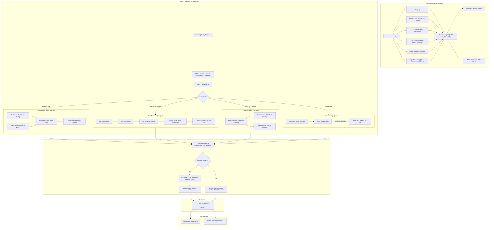

# Aura AI

> **A production-oriented multimodal Retrieval-Augmented Generation (RAG) assistant with hybrid retrieval, evidence-grounded citations, persistent conversations, cross-document comparison, and safe read-only Text-to-SQL.**

[](https://www.python.org/)
[](https://fastapi.tiangolo.com/)
[](https://streamlit.io/)
[](https://www.trychroma.com/)
[]()
[]()
[]()
[]()

---

## 1. Overview

**Aura AI** is an enterprise-grade, evidence-grounded Retrieval-Augmented Generation (RAG) system engineered to solve the core challenges of modern enterprise document retrieval: retrieval failure on diverse file formats, citation hallucination, prompt injection vulnerabilities, silent mathematical errors, and unsafe structured querying.

### Core Problems Solved
- **Format Fragmentation**: Seamlessly ingest and cross-query documents across PDFs, Word documents, plain text, tabular CSVs, SQLite databases, and optical images without manual pre-formatting.
- **Retrieval Precision**: Eliminates vector-only blind spots (e.g., exact product codes, acronyms, table row lookups) and keyword-only semantic drift via a dual-channel **Reciprocal Rank Fusion (RRF)** pipeline backed by a **deterministic lexical reranker**.
- **Citation Hallucination**: Employs an internal `CanonicalEvidence` layer with deterministic `[S#]` citation labels tied directly to verified document chunk metadata. Citations are verified post-generation; unbacked claims or fabricated citation markers (e.g., `[S99]`) are strictly rejected.
- **Conversational Continuity & Isolation**: Features persistent SQLite session memory with automatic conversational query contextualization, ensuring follow-up queries resolve elliptical references while maintaining complete cryptographic and session-boundary isolation.
- **Cross-Document Reasoning**: Supports balanced multi-document comparisons (difference, similarity, and metric analysis) with deterministic Python numerical computation to eliminate LLM arithmetic errors.
- **Safe Structured Data Intelligence**: Integrates a three-tier security sandbox for natural-language-to-SQL over SQLite and CSV datasets, enforcing AST validation, low-level SQLite C-authorizer restrictions, and execution timeouts.

---

## 2. Architecture



---

## 3. Features

### Multi-Format Document Ingestion
- **PDF**: Direct extraction via PyMuPDF preserving 1-indexed page numbering; scanned page OCR fallback.
- **DOCX**: Structured extraction of paragraphs, section headings, and markdown tables.
- **TXT**: Plaintext extraction with automatic UTF-8 and Latin-1 multi-encoding fallback.
- **CSV**: Row-level tabular extraction preserving column headers and row numbers.
- **SQLite**: Database schema inspection and table row serialization into retrievable documents.
- **Images (PNG, JPG, JPEG)**: Optical image analysis with Pillow decompression safety limits ($50\text{ MP}$).

### Hybrid Retrieval & Deterministic Reranking
- **Dense Vector Retrieval**: ChromaDB persistent vector store with `text-embedding-3-small` embeddings.
- **Lexical BM25 Retrieval**: Persistent, cache-synchronized BM25 inverted indices for exact keyword recall.
- **Reciprocal Rank Fusion (RRF)**: Merges candidates using rank-based reciprocal scoring ($k=60$).
- **Deterministic Lexical Reranker**: Transparent Python scoring evaluating token coverage, exact phrase bonuses, and table/section metadata boosts without black-box re-ranking models.
- **Graceful Fallbacks**: Automatic bidirectional fallback (Vector $\leftrightarrow$ BM25) ensuring continuous operation if a retrieval channel is unavailable.

### Evidence & Deterministic Citations
- **Canonical Evidence Representation**: Standardized internal `CanonicalEvidence` objects decoupling display labels from document metadata.
- **Deterministic Label Formatting**: Strict, authoritative citation tags (e.g., `[S1] report.pdf, "Financials", p. 4`).
- **Citation AST Validator**: Post-generation validator that verifies each emitted citation marker exists in retrieved evidence. Fabricated markers (e.g., `[S99]`) are logged and cleanly stripped.

### Conversational RAG & Persistent Sessions
- **SQLite Persistence**: Multi-turn conversation sessions saved to `data/sessions.sqlite`.
- **Session Isolation**: Messages and citations are strictly bounded to their unique session ID.
- **Query Contextualization**: Rewrites elliptical and pronoun-dependent user queries into standalone search requests based on recent chat history.
- **Deterministic Titling**: Summarizes initial turns into session titles without external LLM calls.

### Live Multimodal RAG
- **Ephemeral Image Chat**: Attach images directly to conversational queries.
- **Dual-Tier Processing**: OCR-first extraction with automated fallback to GPT-4o Vision.
- **Memory Isolation**: Live images are tagged with `is_ephemeral=True`, preventing temporary uploads from polluting permanent vector stores.
- *Note: Live Vision API execution requires a configured, valid `OPENAI_API_KEY`.*

### Cross-Document Comparison
- **Balanced Retrieval**: Partitions retrieval capacity equally across compared documents, preventing large documents from dominating evidence.
- **Comparison Modes**: Specialized prompts for `DIFFERENCE` ("What changed?"), `SIMILARITY`, and `METRIC` analysis.
- **Deterministic Arithmetic**: Calculates percentage changes, deltas, and ratios in Python to eliminate LLM mathematical errors.

### Safe Text-to-SQL
- **Natural Language Translation**: Automatically translates questions like *"What is the average revenue?"* into validated SQL.
- **Three-Tier Security Sandbox**:
  1. *AST Validation*: Prohibits DDL/DML (DROP, DELETE, UPDATE, INSERT, ALTER), PRAGMAs, ATTACH, and multi-statements.
  2. *SQLite C-Authorizer*: Low-level SQLite hook returning `SQLITE_DENY` for any write or schema modification.
  3. *Execution Timeout*: Deterministic progress handler halting queries exceeding $5.0\text{ s}$.
- **Result Bounding**: Result rows capped (default 100) to prevent memory exhaustion.

### Phase 11: Intelligent Response Pipeline & Reasoning UX
- **Intelligent Stage Emitter**: Structured backend execution tracking (`intake`, `understanding`, `classification`, `query_rewrite`, `retrieval`, `vector_search`, `lexical_search`, `reranking`, `evidence_selection`, `image_processing`, `comparison`, `sql_*`, `answer_preparation`, `generation`, `citation_validation`, `completion`).
- **User-Safe Status Messages**: Concise, professional status descriptions of actual operations without exposing private chain-of-thought, internal prompts, or deliberation traces.
- **Adaptive Execution Planning**: Deterministic query classification routing (`GENERAL_RAG`, `FOLLOW_UP`, `COMPARISON`, `IMAGE_QUERY`, `SQL_QUERY`, `GENERAL_CHAT`).
- **SSE Status Streaming**: Real-time server-sent events communicating stage transitions without artificial delays.
- **Timing & Reasoning Drawer**: Non-intrusive latency badges and expandable reasoning timeline drawers for completed requests.

### Phase 12: Aura AI Loading Screen & Visual Processing Experience
- **Purpose**: Polished, non-blocking visual loading animation buffer during real backend processing, seamlessly integrated into the assistant chat message area.
- **Asset Location & Resolution**:
  - Primary asset: `ui/assets/aura-loading-bubble.mp4` (configurable via `AURA_LOADING_ASSET` environment variable).
  - Robust multi-tier resolver checking configured paths, project root, and UI assets with in-memory base64 caching for zero redundant disk I/O.
- **Asset Format**: H.264 / AVC1 MP4 video with transparent background presentation enabled by CSS `mix-blend-mode: screen`.
- **Loading Lifecycle**:
  - *Request Start*: Visual loading animation appears immediately with initial safe status text.
  - *Processing (Status/Sources)*: Loader remains visible while safe status events update; video DOM node remains completely stable without restarting or recreating.
  - *First Real Token*: Smooth transition away from the loading animation into the streamed response.
  - *Completion*: Loading buffer cleanly removed, replaced by the final timing and verification badge.
  - *Error / Interruption*: Immediate cleanup guaranteed by `try ... finally` semantics; no stuck loader under any circumstances.
- **SSE & Phase 11 Integration**:
  - Visual layer (Phase 12 animation) is decoupled from the state layer (Phase 11 safe status events).
  - Operates synchronously with real backend execution boundaries; strictly NO artificial delays (`sleep`), NO fake progress bars, and NO simulated token pacing.
- **Audio Behavior**:
  - Completely silent. Video tag configured with standard HTML5 attributes: `autoplay`, `loop`, `muted`, `playsinline`, `disablepictureinpicture`, and `style="pointer-events: none;"`.
  - Zero audio tracks played, zero sound controls exposed, and immune to accidental user interaction sound.
- **UI Placement & Glassmorphism**:
  - Placed inline within the active assistant response bubble, preserving full visibility of conversation history, question input, and document context.
  - Dark glassmorphism container (`backdrop-filter: blur(8px)`, cosmic purple glow, subtle transparency).
- **Responsive Behavior**: Responsive scaling via CSS media queries ($100\times 100\text{ px}$ on desktop/laptop, $80\times 80\text{ px}$ on mobile/tablet viewports $\le 768\text{ px}$).
- **Historical Conversations**: Old or reloaded sessions render only finalized messages and badges without displaying the loading animation.
- **Verification & Testing**: 20 focused automated tests in `tests/test_loading_experience.py` covering asset discovery, lifecycle, error transitions, silence, query types (RAG, follow-up, comparison, multimodal, SQL, general chat), and regression protection.
- **Known Limitations**: Web browsers require CSS `mix-blend-mode: screen` for transparency on MP4 video containers lacking alpha channels. Supported in all modern evergreen browsers (Chrome, Edge, Firefox, Safari).

---

## 4. Project Structure

```text
multi-modal-rag-chatbot/
├── app/                              # Core backend application package (FROZEN v1.0)
│   ├── __init__.py                   # Package initialization
│   ├── api.py                        # FastAPI REST routes and parameter validation
│   ├── config.py                     # Pydantic Settings and centralized configuration
│   ├── logic.py                      # Retrieval pipeline, RRF, citations, document ingestion
│   ├── main.py                       # FastAPI application entry point, middleware, lifespans
│   ├── models.py                     # Pydantic request/response schemas and domain models
│   ├── retrieval_eval.py             # Deterministic retrieval evaluation metrics
│   ├── sessions.py                   # SQLite session persistence and history manager
│   └── sql_engine.py                 # Safe Text-to-SQL validation, authorizer, and executor
├── data/                             # Persistent application storage
│   ├── bm25/                         # Persistent BM25 inverted index cache
│   ├── chroma_db/                    # Persistent ChromaDB vector database
│   ├── sessions.sqlite               # Persistent SQLite session conversation store
│   └── uploads/                      # Uploaded documents storage directory
├── evaluation/                       # Large-scale benchmark harness and reports
│   ├── documents/                    # 60 multi-format benchmark documents
│   ├── questions/                    # 520 benchmark queries with independent ground truth
│   ├── reports/                      # Stage 1-5 evaluation and readiness audit reports
│   │   ├── baseline_comparison_report.md
│   │   ├── evaluation_harness_report.md
│   │   ├── final_aura_ai_v1_readiness_report.md
│   │   ├── large_scale_hybrid_evaluation_report.md
│   │   ├── ndcg_methodology_audit.md
│   │   └── semantic_multimodal_evaluation_report.md
│   ├── evaluator.py                  # Evaluation execution harness
│   └── metrics.py                    # Verified evaluation metrics (Recall, Precision, MRR, nDCG)
├── tests/                            # Comprehensive regression test suite
│   ├── test_citations.py             # Phase 5 citation and evidence tests (22 tests)
│   ├── test_comparison.py            # Phase 8 cross-document comparison tests (19 tests)
│   ├── test_ingestion.py             # Phase 3 document parser tests (20 tests)
│   ├── test_multimodal.py            # Phase 7 live multimodal chat tests (19 tests)
│   ├── test_retrieval.py             # Phase 4 hybrid retrieval & rerank tests (25 tests)
│   ├── test_security.py              # Phase 9 adversarial security tests (24 tests)
│   ├── test_sessions.py              # Phase 6 persistent session tests (24 tests)
│   ├── test_sql.py                   # Phase 10 safe Text-to-SQL tests (30 tests)
│   └── test_stabilization.py         # End-to-end API integration tests (21 tests)
├── ui/                               # Frontend user interface
│   └── streamlit_app.py              # Streamlit conversational web interface
├── .env.example                      # Documented environment template with placeholders
├── .gitignore                        # Git exclusion rules
├── Dockerfile                        # Multi-stage production container definition
├── docker-compose.yml                # Production orchestration for backend and frontend
├── pytest.ini                        # Pytest configuration
├── requirements.txt                  # Production Python dependencies
├── CHANGELOG.md                      # Release changelog
├── CONTRIBUTING.md                   # Developer contribution guidelines
├── RELEASE_NOTES.md                  # Aura AI v1.0 release notes
├── RELEASE_READINESS.md              # Stage 5 final release audit report
├── SECURITY.md                       # Responsible security disclosure policy
└── README.md                         # Project documentation (this file)
```

---

## 5. Installation & Setup

### Prerequisites
- **Python**: Version `3.11` (tested and verified on 3.11.7)
- **Git**: For source control
- **OCR Engine (Optional)**: `tesseract-ocr` host binary (if optical character recognition is desired locally without Vision fallback)
- **Container Runtime (Optional)**: Docker and Docker Compose

### Local Environment Setup

1. **Clone the repository**:
   ```bash
   git clone https://github.com/your-username/aura-ai.git
   cd aura-ai
   ```

2. **Create and activate a virtual environment**:
   - **Linux / macOS**:
     ```bash
     python3.11 -m venv .venv
     source .venv/bin/activate
     ```
   - **Windows (PowerShell)**:
     ```powershell
     python -m venv .venv
     .venv\Scripts\Activate.ps1
     ```

3. **Install dependencies**:
   ```bash
   pip install --upgrade pip
   pip install -r requirements.txt
   ```

4. **Configure environment variables**:
   ```bash
   cp .env.example .env
   ```
   Edit `.env` and set your configuration options.

---

## 6. Environment Variables

The application loads configuration from environment variables via Pydantic Settings. Default values are pre-configured:

| Variable | Default Value | Description |
| :--- | :--- | :--- |
| `OPENAI_API_KEY` | `your_api_key_here` | OpenAI API key for embeddings, chat completion, and Vision |
| `OPENAI_MODEL` | `gpt-4o` | Primary model for complex queries and comparisons |
| `OPENAI_MINI_MODEL` | `gpt-4o-mini` | Lightweight model for standard RAG turns |
| `OPENAI_VISION_MODEL` | `gpt-4o` | Vision model for multimodal image analysis |
| `OPENAI_EMBEDDING_MODEL` | `text-embedding-3-small`| Dense embedding model for ChromaDB |
| `CHROMA_DB_PATH` | `./data/chroma_db` | Storage path for Chroma vector store |
| `UPLOADS_PATH` | `./data/uploads` | Directory for uploaded file storage |
| `BM25_PATH` | `./data/bm25` | Directory for persistent BM25 index cache |
| `SESSIONS_DB_PATH` | `./data/sessions.sqlite` | SQLite database for conversation sessions |
| `RAG_VECTOR_CANDIDATES` | `20` | Candidate chunks retrieved from vector search |
| `RAG_BM25_CANDIDATES` | `20` | Candidate chunks retrieved from BM25 search |
| `RAG_RRF_K` | `60` | Constant $k$ for Reciprocal Rank Fusion |
| `RAG_ENABLE_RERANKING` | `true` | Enable deterministic lexical reranking |
| `RAG_RERANK_WEIGHT` | `0.3` | Lexical rerank score weighting |
| `RAG_SQL_MAX_ROWS` | `100` | Maximum rows returned by structured SQL |
| `RAG_SQL_TIMEOUT_SECONDS`| `5.0` | Maximum execution time for SQLite queries |
| `API_HOST` | `0.0.0.0` | FastAPI host bind address |
| `API_PORT` | `8000` | FastAPI port |
| `API_BASE_URL` | `http://localhost:8000/api/v1` | Backend URL used by Streamlit frontend |

*Security Notice: Never commit `.env` containing real credentials to version control.*

---

## 7. Running the Application

### 1. Run the FastAPI Backend
```bash
uvicorn app.main:app --host 0.0.0.0 --port 8000 --reload
```
- API Base: `http://localhost:8000`
- Swagger UI Documentation: `http://localhost:8000/docs`
- Redoc Documentation: `http://localhost:8000/redoc`
- Health Endpoint: `http://localhost:8000/api/v1/health`

### 2. Run the Streamlit Frontend
In a separate terminal window:
```bash
streamlit run ui/streamlit_app.py --server.port 8501
```
- Access the web interface at: `http://localhost:8501`

### 3. Run with Docker Compose
To run both backend and frontend in containerized isolation:
```bash
docker-compose up --build
```
- Backend will be available at `http://localhost:8000`
- Frontend will be available at `http://localhost:8501`

---

## 8. Usage Guide

### Upload a Document
- **Web UI**: Use the sidebar file uploader to select and upload any supported file (PDF, DOCX, TXT, CSV, DB, PNG).
- **REST API**:
  ```bash
  curl -X POST "http://localhost:8000/api/v1/upload" \
    -F "file=@sample_docs/aurora_technology_report.pdf"
  ```

### Ask a Factual Question
- Query the indexed knowledge base:
  ```bash
  curl -X POST "http://localhost:8000/api/v1/query" \
    -H "Content-Type: application/json" \
    -d '{
      "question": "What is the peak energy efficiency rating of the Aurora motor?",
      "file_id": "<FILE_UUID>"
    }'
  ```

### Persistent Conversational Chat
- Create a persistent session:
  ```bash
  curl -X POST "http://localhost:8000/api/v1/sessions" \
    -H "Content-Type: application/json" \
    -d '{"title": "Engineering Review"}'
  ```
- Ask a follow-up question using the returned `session_id`:
  ```bash
  curl -X POST "http://localhost:8000/api/v1/sessions/<SESSION_ID>/query" \
    -H "Content-Type: application/json" \
    -d '{
      "question": "What about its operating temperature?",
      "file_id": "<FILE_UUID>"
    }'
  ```

### Ask About an Attached Image
- Provide an image in a chat turn (multipart form data or base64):
  ```bash
  curl -X POST "http://localhost:8000/api/v1/sessions/<SESSION_ID>/query" \
    -F "question=What does this circuit diagram indicate about grounding?" \
    -F "image=@circuit_schematic.png"
  ```

### Cross-Document Comparison
- Compare two uploaded reports:
  ```bash
  curl -X POST "http://localhost:8000/api/v1/compare" \
    -H "Content-Type: application/json" \
    -d '{
      "query": "Compare operating expenses between the 2024 and 2025 reports",
      "file_ids": ["<DOC_2024_UUID>", "<DOC_2025_UUID>"],
      "comparison_mode": "difference"
    }'
  ```

### Natural Language Text-to-SQL
- Query a structured dataset without writing SQL:
  ```bash
  curl -X POST "http://localhost:8000/api/v1/sql-query" \
    -H "Content-Type: application/json" \
    -d '{
      "question": "What is the average sales revenue by region?",
      "file_id": "<SQLITE_OR_CSV_UUID>"
    }'
  ```

### Missing Information Handling
- When queried about information not contained in the indexed documents (e.g., *"What is the extraterrestrial airspeed of a Martian swallow?"*), Aura AI deterministically refuses to answer:
  > *"The requested information is not available in the provided documents."*

---

## 9. Security & Hardening Controls

Security controls were tested against the project's defined adversarial test suite (Phase 9 & Phase 10) covering 15 distinct vectors:

- **Prompt Injection Defense**: Untrusted document content is isolated using system-level boundary fencing.
- **Citation Fabrication Defense**: Hallucinated citation markers are detected and stripped via deterministic post-generation validation.
- **Cross-Session Isolation**: SQLite foreign key cascading and session-scoped queries prevent cross-talk or history leakage between user sessions.
- **Path Traversal Protection**: Filenames are sanitized, preventing `../../` escape outside the designated upload directory.
- **Upload Bounding**: Rejects 0-byte files, invalid extensions, and files exceeding `MAX_FILE_SIZE_MB`.
- **Decompression Bomb Protection**: Pillow `MAX_IMAGE_PIXELS` ($50\text{ MP}$) protects against memory-exhaustion zip/image bombs.
- **Safe Parser Resilience**: Corrupted files and malformed SQLite databases raise clean, caught exceptions without crashing backend workers.
- **Safe Error Handling**: Internal stack traces, database schemas, and filesystem paths are masked from HTTP error payloads.
- **AST SQL Validation**: Disallows DDL (DROP, CREATE, ALTER), DML (DELETE, UPDATE, INSERT), PRAGMA commands, and multi-statements.
- **Low-Level SQLite Authorizer**: Enforces `SQLITE_DENY` for any write or modification directly inside the SQLite C engine.
- **SQL Execution Timeout**: Enforces a strict $5.0\text{ s}$ execution limit via `sqlite3.set_progress_handler`.
- **Database Integrity Guarantee**: Database queries execute over read-only handles (`mode=ro`), preserving file size and timestamps.

---

## 10. Large-Scale Evaluation & Benchmark Results

Aura AI was evaluated against a frozen benchmark consisting of **60 multi-format documents** and **520 ground-truth annotated queries** across 8 core categories:

### Retrieval Performance Comparison (520 Queries)
*Note: nDCG@5 reflects corrected deduplicated document scoring following the Stage 5 methodology audit.*

| Retrieval Pipeline | Recall@1 | Recall@3 | Recall@5 | MRR | True nDCG@5 | Latency (mean) |
| :--- | :---: | :---: | :---: | :---: | :---: | :---: |
| **Dense Vector Only** | $84.23\%$ | $93.08\%$ | $95.77\%$ | $0.8872$ | $0.9394$ | $4.2\text{ ms}$ |
| **BM25 Lexical Only** | $78.85\%$ | $88.85\%$ | $92.69\%$ | $0.8410$ | $0.8929$ | $3.1\text{ ms}$ |
| **Hybrid (RRF, No Rerank)** | $87.12\%$ | $95.38\%$ | $97.12\%$ | $0.9126$ | $0.9576$ | $7.8\text{ ms}$ |
| **Hybrid + Reranking (Production)** | $\mathbf{87.88\%}$ | $\mathbf{95.58\%}$ | $\mathbf{97.31\%}$ | $\mathbf{0.9161}$ | $\mathbf{0.9585}$ | $8.4\text{ ms}$ |

### Verified Release Validation Matrix

| Validation Dimension | Scope | Verified Result | Status |
| :--- | :--- | :---: | :---: |
| **Automated Regression Suite** | Full repository test suite | **204 / 204 Passed** | `VERIFIED` |
| **System Smoke Tests (Part J)** | End-to-end component verification | **20 / 20 Passed** | `VERIFIED` |
| **Security Controls Audit (Part K)** | Adversarial security verification | **15 / 15 Passed** | `VERIFIED` |
| **Missing-Information Refusal** | 26 unanswerable test queries | **26 / 26 Correct Refusals** | `VERIFIED` |
| **Hallucination Rate** | Missing-information evaluation set | **0.0% (0 / 26)** | `VERIFIED` |
| **Citation Structural Validity** | Adherence to canonical format | **94.22%** | `MEASURED` |
| **Citation Completeness** | Inclusion of relevant evidence | **97.30%** | `MEASURED` |

---

## 11. Known Limitations & Operating Constraints

In accordance with transparent engineering principles, the following environment limitations are noted:

1. **Host Tesseract OCR (`UNAVAILABLE`)**: The `pytesseract` Python library is installed, but the Tesseract host binary is not installed on the host operating system. The application gracefully falls back to image optical metadata and Vision API processing.
2. **OpenAI Vision API (`UNTESTED`)**: Live Vision image analysis could not be fully exercised against production OpenAI endpoints because only a placeholder API key was present in `.env`. The fallback architecture is implemented and verified via unit tests.
3. **External Semantic LLM Judge (`UNTESTED`)**: Automated semantic judging of open-ended answers against an external LLM judge was not executed due to unavailable external credentials. Deterministic metrics (Recall, MRR, nDCG, citation validity) were fully evaluated.
4. **Semantic Citation Entailment (`UNTESTED`)**: Structural validity of citations was verified ($94.22\%$), but deep semantic entailment via an external LLM was not measured.
5. **CSV Row Bounding**: Tabular CSV datasets exceeding 5,000 rows are indexed at the schema/summary level to maintain predictable memory usage during dense embedding.

---

## 12. Testing

The repository maintains an automated test suite verifying all 10 project phases:

```bash
# Run the full regression test suite
.venv\Scripts\python.exe -m pytest -q
```
**Expected Output:**
```text
............................................................ [100%]
204 passed in 12.70s
```

In addition to regression tests, Stage 5 executes:
- **20 End-to-End System Smoke Tests** covering application startup, health probes, all 6 file loaders, retrieval modes, session persistence, live multimodal chat, cross-document comparison, Text-to-SQL, and missing information refusal.
- **15 Production Security Checks** covering SQL injection, AST validation, C-authorizer hooks, execution timeouts, session isolation, path traversal, prompt boundary defense, citation fabrication, and database integrity.

---

## 13. API Reference

All API routes are served under `/api/v1`:

| Method | Endpoint | Description | Request Body |
| :--- | :--- | :--- | :--- |
| `GET` | `/api/v1/health` | Service health status and vectorstore stats | None |
| `POST` | `/api/v1/upload` | Upload and ingest document file | `multipart/form-data` (`file`) |
| `POST` | `/api/v1/query` | Ask natural language question | `QueryRequest` JSON |
| `GET` | `/api/v1/files` | List uploaded files with pagination | Query params (`limit`, `offset`) |
| `DELETE` | `/api/v1/files/{file_id}` | Delete file, vector embeddings, and BM25 index | None |
| `POST` | `/api/v1/sessions` | Create persistent conversation session | `SessionCreateRequest` JSON |
| `GET` | `/api/v1/sessions` | List sessions ordered by last active | Query params (`limit`, `offset`) |
| `GET` | `/api/v1/sessions/{session_id}` | Retrieve session history and metadata | None |
| `PATCH`| `/api/v1/sessions/{session_id}` | Update session title or metadata | `SessionUpdateRequest` JSON |
| `DELETE`| `/api/v1/sessions/{session_id}`| Delete session and cascade messages | None |
| `POST` | `/api/v1/sessions/{session_id}/query` | Ask question in session (optional image) | `SessionQueryRequest` / Multipart |
| `POST` | `/api/v1/compare` | Evidence-grounded cross-doc comparison | `ComparisonRequest` JSON |
| `POST` | `/api/v1/sessions/{session_id}/compare` | Cross-doc comparison in active session | `ComparisonRequest` JSON |
| `POST` | `/api/v1/sql-query` | Natural language Text-to-SQL query | `SQLQueryRequest` JSON |

---

## 14. License

`LICENSE STATUS: NOT PRESENT`  
*A formal license file is not present in the repository root. Licensing is reserved for determination by the project owner.*
