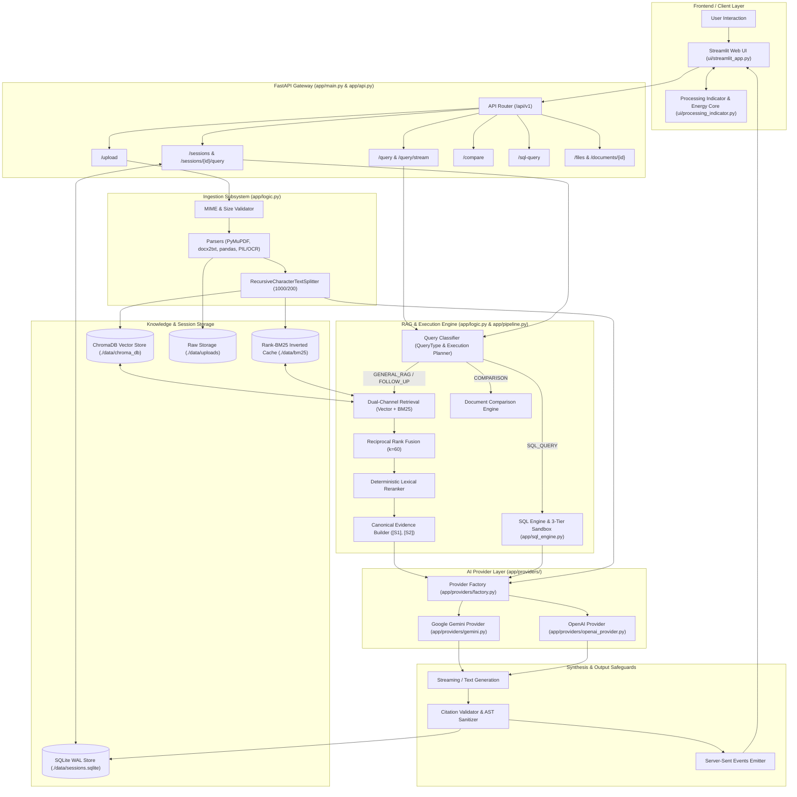
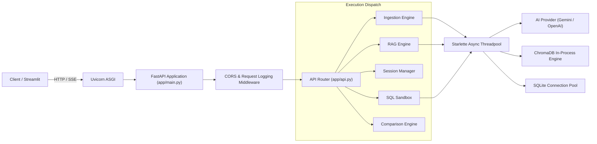
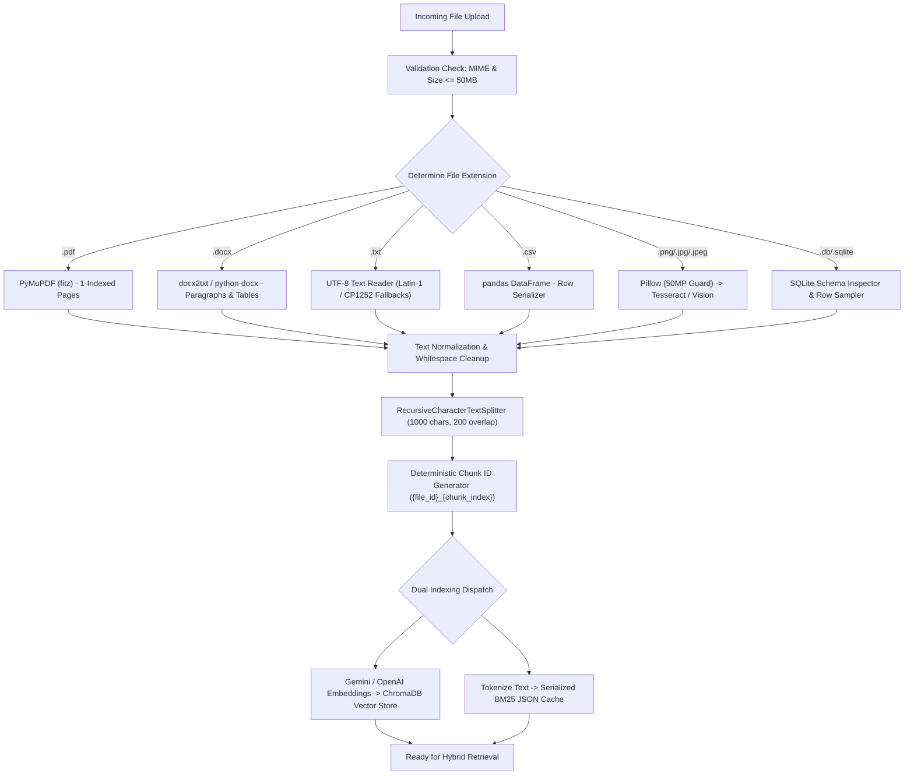
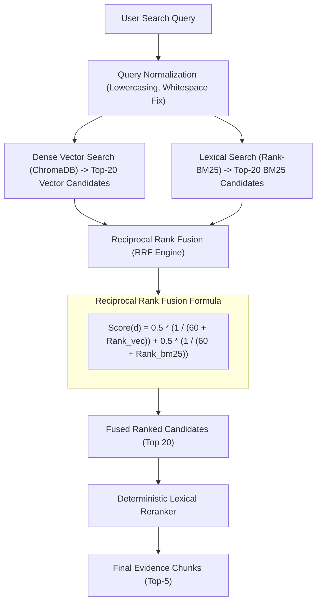
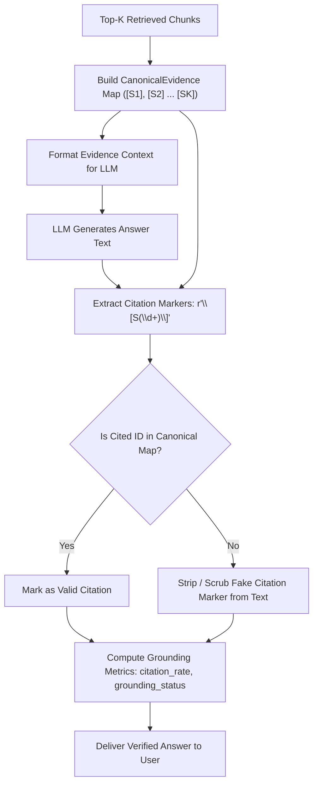
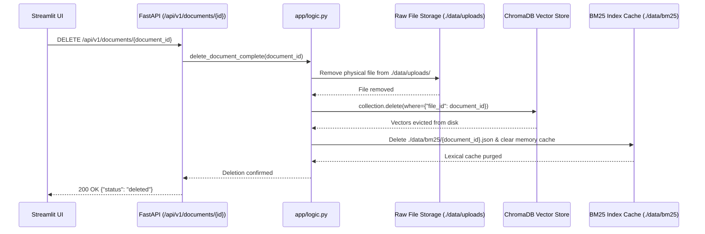
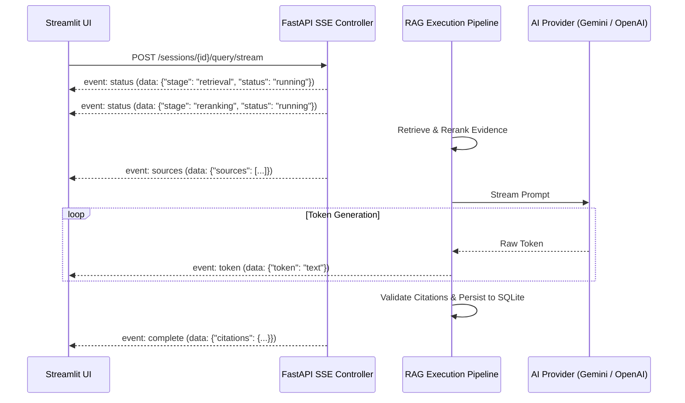
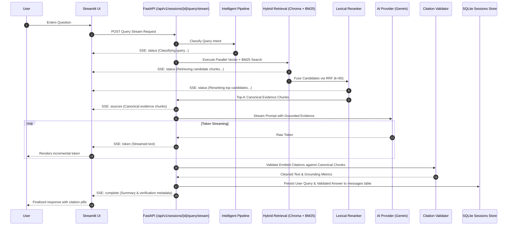
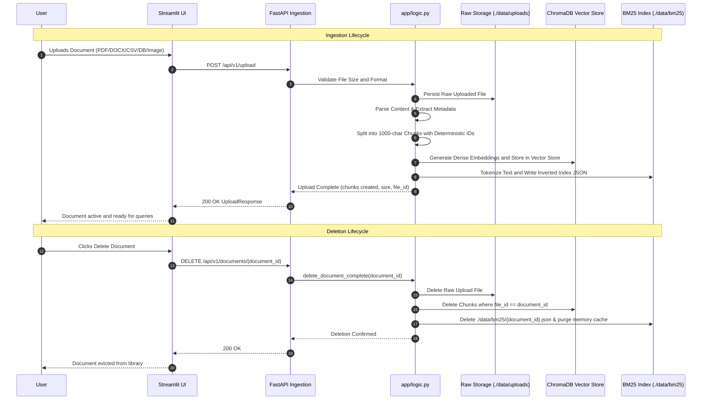
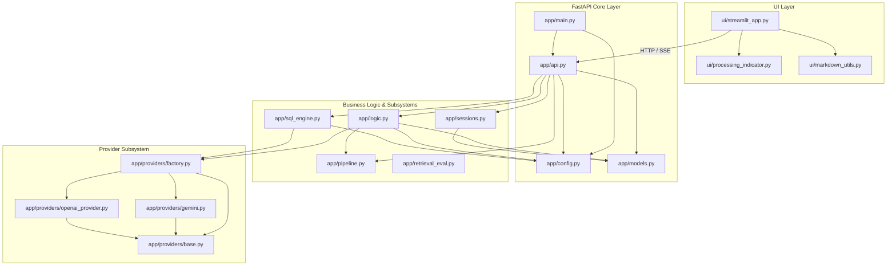

# Aura AI — Complete Technical Documentation

> **Master Technical Specification and Architecture Manual**  
> **Repository:** `multi-modal-rag-chatbot`  
> **Active Environment:** Python 3.11 • FastAPI • Streamlit • ChromaDB • Google Gemini • SQLite WAL  
> **Validation Status:** Certified Stable • 529 / 529 Passing Tests (100% Green, 0 Failures)  
> **Design Philosophy:** Evidence-grounded, multi-modal, zero-hallucination, secure by design, transparent execution.

---

## Table of Contents

1. [Project Overview & Core Capabilities](#1-project-overview)
2. [Problem Statement & Architectural Goals](#2-problem-statement--architectural-goals)
3. [System Architecture](#3-system-architecture)
4. [Technology Stack](#4-technology-stack)
5. [Directory Structure](#5-directory-structure)
6. [Complete File-by-File Documentation](#6-complete-file-by-file-documentation)
7. [Backend Architecture](#7-backend-architecture)
8. [Complete API Endpoint Reference](#8-complete-api-endpoint-reference)
9. [Document Ingestion Pipeline](#9-document-ingestion-pipeline)
10. [Chunking and Metadata Provenance](#10-chunking-and-metadata-provenance)
11. [Embedding Architecture](#11-embedding-architecture)
12. [Vector Database & ChromaDB Architecture](#12-vector-database--chromadb-architecture)
13. [BM25 & Lexical Retrieval Engine](#13-bm25--lexical-retrieval-engine)
14. [Hybrid Retrieval & Reciprocal Rank Fusion](#14-hybrid-retrieval--reciprocal-rank-fusion)
15. [Deterministic Lexical Reranking](#15-deterministic-lexical-reranking)
16. [Query Classification & Routing](#16-query-classification--routing)
17. [Intelligent Processing Pipeline & Status Engine](#17-intelligent-processing-pipeline--status-engine)
18. [RAG Query Execution Flow](#18-rag-query-execution-flow)
19. [Conversational Follow-Up Flow & Contextual Rewriting](#19-conversational-follow-up-flow--contextual-rewriting)
20. [Citation & Evidence Verification System](#20-citation--evidence-verification-system)
21. [Multimodal Vision & Image Processing](#21-multimodal-vision--image-processing)
22. [Image-Only Grounding Rules](#22-image-only-grounding-rules)
23. [Session Architecture & SQLite Relational Store](#23-session-architecture--sqlite-relational-store)
24. [Chat Renaming Architecture](#24-chat-renaming-architecture)
25. [Document Deletion & Atomic Index Eviction](#25-document-deletion--atomic-index-eviction)
26. [Chat Streaming Architecture & SSE Protocol](#26-chat-streaming-architecture--sse-protocol)
27. [Structured Text-to-SQL Subsystem & Security Sandbox](#27-structured-text-to-sql-subsystem--security-sandbox)
28. [Cross-Document Comparison Subsystem](#28-cross-document-comparison-subsystem)
29. [Provider Architecture & Factory Abstraction](#29-provider-architecture--factory-abstraction)
30. [Google Gemini Integration](#30-google-gemini-integration)
31. [Configuration Reference & Environment Variables](#31-configuration-reference--environment-variables)
32. [Persistent Data Storage & Directory Management](#32-persistent-data-storage--directory-management)
33. [UI Architecture & Streamlit Lifecycle](#33-ui-architecture--streamlit-lifecycle)
34. [UI Design System & Theming Specifications](#34-ui-design-system--theming-specifications)
35. [Processing Indicator & Visual Feedback Architecture](#35-processing-indicator--visual-feedback-architecture)
36. [Background Visual System & Media Playback](#36-background-visual-system--media-playback)
37. [Security Architecture & Threat Mitigation](#37-security-architecture--threat-mitigation)
38. [Error Handling & Resiliency Model](#38-error-handling--resiliency-model)
39. [Performance Architecture & Latency Optimizations](#39-performance-architecture--latency-optimizations)
40. [Evaluation Framework & Offline Benchmark Suite](#40-evaluation-framework--offline-benchmark-suite)
41. [Testing Architecture & Automated Quality Gates](#41-testing-architecture--automated-quality-gates)
42. [Operational Commands & CLI Guide](#42-operational-commands--cli-guide)
43. [Containerization & Deployment Architecture](#43-containerization--deployment-architecture)
44. [Master Request Lifecycle Sequence Diagram](#44-master-request-lifecycle-sequence-diagram)
45. [Master Document Lifecycle Sequence Diagram](#45-master-document-lifecycle-sequence-diagram)
46. [Complete Component Dependency Map](#46-complete-component-dependency-map)
47. [Data Models & Schema Specifications](#47-data-models--schema-specifications)
48. [Key System Constants & Default Parameters](#48-key-system-constants--default-parameters)
49. [Evolution History & Development Phases](#49-evolution-history--development-phases)
50. [Current Implementation Status Matrix](#50-current-implementation-status-matrix)
51. [Known Limitations & Boundary Constraints](#51-known-limitations--boundary-constraints)
52. [Operational Troubleshooting Runbook](#52-operational-troubleshooting-runbook)
53. [Engineering Guidelines & Best Practices](#53-engineering-guidelines--best-practices)
54. [How to Add a New LLM Provider](#54-how-to-add-a-new-llm-provider)
55. [How to Add a New Embedding Provider](#55-how-to-add-a-new-embedding-provider)
56. [How to Add a New Document Format](#56-how-to-add-a-new-document-format)
57. [How to Safely Modify the UI](#57-how-to-safely-modify-the-ui)
58. [Glossary of Terms](#58-glossary-of-terms)
59. [Master Workflow Walkthroughs](#59-master-workflow-walkthroughs)
60. [Future Architectural Roadmap](#60-future-architectural-roadmap)

---

## 1. Project Overview

### Simple Explanation
Aura AI is an intelligent conversational document assistant. When you upload PDFs, Word files, spreadsheets, databases, or images, Aura AI lets you have an interactive conversation with them. Instead of giving vague answers or making things up, Aura AI finds the exact passages in your files, shows you where it found the information with numbered citations (`[S1]`, `[S2]`), and updates you in real time as it searches and reads.

### Technical Explanation
Aura AI is an enterprise-grade, multi-modal Retrieval-Augmented Generation (RAG) system engineered in Python 3.11 with a decoupled architecture: an asynchronous FastAPI backend paired with a high-performance Streamlit frontend. It resolves the classic trade-offs of semantic vs. lexical search by implementing dual-channel hybrid retrieval combining dense 768-dimensional Google Gemini embeddings in ChromaDB with an exact inverted index via Rank-BM25. Retrieved candidates are fused using Reciprocal Rank Fusion ($k=60$) and reranked using a deterministic lexical scorer before generation. Answers are synthesized with strict citation grounding, verified post-generation by an automated citation validator, and streamed token-by-token over Server-Sent Events (SSE).

### Core Capabilities

- **Heterogeneous Document Ingestion**: Ingests and extracts content from PDF (PyMuPDF), DOCX (python-docx), TXT, CSV (pandas), relational SQLite databases, and images (OCR & Vision).
- **Dual-Channel Hybrid Retrieval**: Combines semantic dense vector search (ChromaDB) with lexical keyword matching (Rank-BM25) to eliminate retrieval misses on both conceptual queries and exact identifiers.
- **Reciprocal Rank Fusion & Reranking**: Merges heterogeneous candidate lists using weighted Reciprocal Rank Fusion ($RRF$) followed by deterministic lexical scoring (exact phrase bonuses, term density, metadata matching).
- **Evidence-Grounded Citations**: Formats context into structured canonical evidence blocks (`[S1]`, `[S2]`) with chunk index, page numbers, and row numbers. Emitted citations are strictly validated and pruned if unbacked.
- **Multimodal Image Queries**: Supports standalone image analysis or simultaneous multi-image question answering, integrating optical character recognition (OCR) with deep vision models.
- **Cross-Document Comparative Analysis**: Dedicated comparison engine with automated alignment, arithmetic difference calculation, and contradiction detection across multiple documents.
- **Three-Tier Read-Only Text-to-SQL**: Translates natural language questions to SQL queries over SQLite databases with strict read-only sandboxing (AST validation, SQLite C-authorizer, read-only connection, and execution timeouts).
- **Persistent Conversational Memory**: ACID-compliant SQLite session store utilizing Write-Ahead Logging (`WAL`), cascading foreign keys, and multi-turn query contextualization.
- **Real-Time Streaming & Pipeline Status**: Server-Sent Events (SSE) streaming with granular, user-safe pipeline execution events (intake, vector search, BM25, rerank, generation, citation validation).
- **AI Provider Abstraction**: Dynamic provider factory supporting Google Gemini (`gemini-3.1-flash-lite`, `gemini-3.5-flash`, `gemini-3.1-pro-preview`) and OpenAI (`gpt-4o`, `gpt-4o-mini`), with isolated vector collections per model.
- **Comprehensive Test Harness**: Rigorously validated with 529 automated unit, integration, security, and UI regression tests.

---

## 2. Problem Statement & Architectural Goals

### Problems Solved
1. **The Knowledge Cutoff & Isolation Problem**: Standard large language models lack access to proprietary, local, or newly generated corporate documents.
2. **The Lexical vs. Semantic Retrieval Deficit**:
   - Pure semantic search fails on part numbers, exact acronyms, source codes, and technical jargon due to vector space compression.
   - Pure keyword search fails on conceptual synonyms, multilingual phrasing, and exploratory questions.
3. **The LLM Hallucination Dilemma**: Generative models frequently fabricate believable citations, statistics, and assertions when direct evidence is lacking.
4. **Data Format Fragmentation**: Knowledge lives across disjointed formats: scanned PDFs, Word reports, CSV data tables, database dumps, and architecture diagrams.
5. **SQL Injection in Natural Language Querying**: Direct model interaction with relational databases creates severe risks of unauthorized writes, drops, or exfiltration.

### Core Architectural Goals
- **Verifiable Grounding**: Every factual assertion must be attributed to an explicitly retrieved text chunk.
- **Deterministic Pipeline Safety**: Safety checks (read-only authorizers, citation scrubbers, path sanitizers) must run as deterministic code, not probabilistic model prompts.
- **Zero Blocked UI**: Heavy parsing, vector indexing, and generation runs asynchronously; the user interface provides live non-blocking feedback.
- **Complete State Isolation**: Document deletions must purge raw files, vector chunks, BM25 indices, and memory caches with zero residual artifacts.

---

## 3. System Architecture



---

## 4. Technology Stack

| Layer | Technology | Version / Spec | Purpose in Aura AI |
| :--- | :--- | :--- | :--- |
| **Language** | Python | 3.11+ | Core runtime platform; async/await concurrency, typing, fast execution. |
| **Backend Framework** | FastAPI | >= 0.109.0 | Asynchronous REST and Server-Sent Events (SSE) gateway. |
| **ASGI Server** | Uvicorn | Standard | Production ASGI web server running FastAPI. |
| **Frontend Framework** | Streamlit | >= 1.32.0 | Stateful, reactive, glassmorphic UI; session management and event consumption. |
| **LLM Provider (Primary)**| Google Gemini | `google-genai` SDK | Text generation, vision analysis, text-to-SQL (`gemini-3.1-flash-lite`, `gemini-3.5-flash`). |
| **Embedding Model** | Google Gemini | `gemini-embedding-001` | 768-dimensional dense vector embeddings optimized for retrieval tasks. |
| **LLM Provider (Secondary)**| OpenAI | `openai` SDK | Backward-compatible provider abstraction (`gpt-4o`, `gpt-4o-mini`). |
| **Vector Database** | ChromaDB | Local In-Process | Embedded vector store persisting dense chunk embeddings and metadata. |
| **Lexical Engine** | Rank-BM25 | In-Memory + Disk | Fast BM25 keyword matching for exact alphanumeric, code, and name retrieval. |
| **Session Database** | SQLite | 3.x (WAL mode) | ACID-compliant relational persistence for chat sessions, messages, and citations. |
| **PDF Extraction** | PyMuPDF (`fitz`) | `pymupdf` | 1-indexed, fast PDF text extraction with layout preservation. |
| **DOCX Extraction** | `docx2txt` / `python-docx` | Standard | Paragraph, heading, and table extraction from Microsoft Word documents. |
| **Data Tabular Engine** | pandas | Standard | CSV parsing, structured schema discovery, and row serialization. |
| **Image Processing** | Pillow (`PIL`) | Standard | Image format validation, decompression bomb protection (50MP max), resizing. |
| **OCR Fallback** | pytesseract | Standard | Optical character recognition for scanned diagrams, screenshots, and PDFs. |
| **Settings Management** | Pydantic Settings | v2 | Strongly typed, environment-driven configuration management (`.env`). |
| **Testing Harness** | pytest | 9.x | 529 automated unit, integration, security, and regression tests. |
| **Containerization** | Docker & Compose | Compose 3.8 | Multi-container setup for decoupled backend and frontend deployment. |

---

## 5. Directory Structure

```
multi-modal-rag-chatbot/
├── app/                               # Core backend production application
│   ├── __init__.py                    # Package initializer
│   ├── api.py                         # FastAPI route definitions and request controllers
│   ├── config.py                      # Pydantic Settings configuration engine
│   ├── logic.py                       # Document ingestion, RAG, hybrid search, citations
│   ├── main.py                        # FastAPI application entrypoint, middleware, lifespan
│   ├── models.py                      # Pydantic request/response and domain models
│   ├── pipeline.py                    # Intelligent response pipeline & status engine
│   ├── retrieval_eval.py              # In-memory batch retrieval metrics (Recall, Precision, MRR)
│   ├── sessions.py                    # SQLite session manager with WAL and cascading delete
│   ├── sql_engine.py                  # Text-to-SQL engine with 3-tier read-only sandbox
│   └── providers/                     # AI provider abstraction layer
│       ├── __init__.py                # Provider package initializer
│       ├── base.py                    # BaseAIProvider interface and provider exceptions
│       ├── factory.py                 # Provider factory singleton resolution
│       ├── gemini.py                  # Official Google Gemini provider implementation
│       └── openai_provider.py         # OpenAI provider implementation
├── data/                              # Persistent storage root
│   ├── bm25/                          # Serialized BM25 JSON inverted indices per file
│   ├── chroma_db/                     # ChromaDB SQLite and parquet vector storage
│   ├── sessions.sqlite                # Relational SQLite database for conversations
│   ├── temp/                          # Ephemeral files (temporary live images)
│   └── uploads/                       # Canonical uploaded raw files
├── evaluation/                        # Offline RAG evaluation harness & benchmarks
│   ├── evaluator.py                   # Document indexer and query runner for evaluations
│   ├── metrics.py                     # Evaluation metrics (Recall@K, MRR, EM, Token F1, LLM Judge)
│   ├── run.py                         # Benchmark runner with bootstrap 95% confidence intervals
│   ├── documents/                     # 61 evaluation test corpus files (PDF, DOCX, CSV)
│   ├── ground_truth/                  # Ground truth benchmark reference datasets
│   └── questions/                     # Benchmark evaluation query sets
├── sample_docs/                       # Demonstration and test documents
├── scripts/                           # Operational and diagnostic scripts
│   ├── benchmark_performance.py       # Performance testing and latency profiler
│   ├── clean_test_sessions.py         # Utility to purge test sessions from SQLite
│   └── test_gemini.py                 # Gemini connectivity and quota diagnostic script
├── tests/                             # Comprehensive test suite (34 test files, 529 tests)
│   ├── conftest.py                    # Pytest test fixtures and mocked providers
│   ├── test_citations.py              # Citation formatting and validation tests
│   ├── test_comparison.py             # Document comparison and arithmetic tests
│   ├── test_document_deletion.py      # Complete document deletion and index eviction tests
│   ├── test_gemini_error_handling.py  # Quota 429 and 503 retry tests
│   ├── test_ingestion.py              # Multi-format document parser tests
│   ├── test_loading_experience.py     # UI loading animation and timing tests
│   ├── test_multimodal.py             # Vision and image analysis tests
│   ├── test_pipeline_status.py        # Pipeline stage emission and event tests
│   ├── test_providers.py              # Provider factory and collection isolation tests
│   ├── test_retrieval.py              # Vector, BM25, and RRF retrieval tests
│   ├── test_security.py               # Prompt injection, path traversal, decompression bomb tests
│   ├── test_sessions.py               # SQLite session CRUD and isolation tests
│   ├── test_sql.py                    # SQL sandbox, AST check, and authorizer tests
│   ├── test_streaming.py              # SSE stream protocol and token tests
│   ├── test_ui_background.py          # UI background and glass hierarchy tests
│   └── test_ui_icons.py               # UI icon asset verification tests
├── ui/                                # Streamlit frontend application
│   ├── assets/                        # Brand symbol (goku.jpg), SVGs, video assets
│   ├── markdown_utils.py              # Markdown sanitization and cleaning utilities
│   ├── processing_indicator.py        # Standalone, reusable UI processing indicator
│   └── streamlit_app.py               # Main Streamlit web application
├── .env.example                       # Reference environment variables template
├── docker-compose.yml                 # Docker multi-container composition
├── Dockerfile                         # Backend container definition
├── pytest.ini                         # Pytest execution configuration
└── requirements.txt                   # Production Python package dependencies
```

---

## 6. Complete File-by-File Documentation

### `app/main.py`
- **Purpose**: Main FastAPI application entrypoint. Configures lifespan events, CORS middleware, global exception handlers, and mounts API routers.
- **Responsibilities**:
  - Initializes application lifespan and logs startup paths.
  - Implements CORS middleware with origins loaded from `settings.cors_origins_list`.
  - Implements `log_requests` HTTP middleware capturing request methods, paths, status codes, and `X-Process-Time`.
  - Handles `RequestValidationError`, `ProviderError` (returning appropriate 429/503 status), `HTTPException`, and generic 500 errors.
  - Exposes the root `/` endpoint providing API metadata and links.
- **Key Functions**:
  - `lifespan(app: FastAPI)`: Asynchronous context manager for startup and graceful shutdown.
  - `log_requests(request: Request, call_next)`: Measures and logs per-request processing latency.
  - `root()`: Returns application title, version, documentation URLs, and health endpoint paths.
- **Used by**: `uvicorn` entrypoint, Docker container backend process.

### `app/api.py`
- **Purpose**: Defines all HTTP and Server-Sent Event (SSE) endpoints under the `/api/v1` namespace.
- **Responsibilities**:
  - Validates request payloads using Pydantic models.
  - Routes document uploads, deletions, conversational queries, sessions, comparisons, and SQL tasks to `app/logic.py` and `app/sessions.py`.
  - Implements SSE streaming endpoints using `StreamingResponse(media_type="text/event-stream")`.
- **Key Endpoints / Functions**:
  - `health_check()`: Verifies system health and reports active AI and embedding providers.
  - `upload_file()`: Validates and ingests uploaded files.
  - `query_api()` / `query_stream_api()`: Non-session RAG execution endpoints.
  - `create_new_session()`, `list_all_sessions()`, `get_session_details()`, `update_session_details()`, `delete_session_endpoint()`: Complete session CRUD.
  - `query_session_endpoint()`, `query_session_stream_endpoint()`: Multi-turn session queries.
  - `compare_documents_endpoint()`, `compare_session_documents_endpoint()`: Document comparison.
  - `execute_sql_query_endpoint()`: Structured database queries.
  - `delete_file()`, `delete_document()`: Complete multi-index file deletion.
- **Dependencies**: `app.logic`, `app.sessions`, `app.models`, `app.config`.

### `app/logic.py`
- **Purpose**: The central processing engine of Aura AI. Implements parsing, text splitting, embeddings, vectorstore management, BM25 indexing, hybrid retrieval, fusion, reranking, evidence creation, citation validation, query execution, streaming, comparison, and SQL dispatch.
- **Responsibilities**:
  - Multi-format ingestion (`process_pdf`, `process_docx`, `process_txt`, `process_csv`, `process_image`, `process_database`).
  - ChromaDB singleton client management with collection isolation.
  - Inverted BM25 index generation and disk caching (`BM25IndexManager`).
  - Dual-channel search execution, Reciprocal Rank Fusion, and deterministic lexical reranking.
  - Canonical evidence generation and post-generation citation validation.
  - SSE streaming formatting (`format_sse_event`) and token yield management.
- **Key Classes**:
  - `FileBM25Index`: Represents a tokenized BM25 index for a single document.
  - `BM25IndexManager`: Manages in-memory cache and disk persistence of document BM25 indices.
  - `RetrievalCandidate`: Intermediate data container for candidate chunks during retrieval.
  - `CanonicalEvidence`: Structured, verified source reference passed to the generation prompt.
- **Key Functions**:
  - `process_document(file_path, file_id, original_filename)`: Dispatches to format-specific parser.
  - `execute_retrieval_pipeline(query, filter_file_ids, top_k)`: Full dual-channel retrieval, RRF, and rerank flow.
  - `reciprocal_rank_fusion(vector_results, bm25_results, k)`: Merges ranked candidate lists.
  - `rerank_candidates(query, candidates, top_k)`: Deterministic lexical reranker.
  - `validate_citations(answer_text, canonical_evidence)`: Prunes unsupported citation markers.
  - `perform_session_rag_query_stream(...)`: Master generator driving SSE streaming responses.
- **Do not change casually**: The citation validation regex and RRF score mathematical constants are tightly coupled with automated regression tests.

### `app/config.py`
- **Purpose**: Centralized application configuration engine using Pydantic Settings.
- **Responsibilities**:
  - Loads configuration with priority: Environment Variables > `.env` > `.env.example` > Defaults.
  - Enforces valid provider selections (`AI_PROVIDER`, `EMBEDDING_PROVIDER`).
  - Resolves active API keys with validation against placeholder values (`require_api_key()`).
  - Ensures critical storage directories exist on module import (`ensure_directories()`).
- **Key Properties**:
  - `max_file_size_bytes`: Converts MB limit to bytes.
  - `resolved_embedding_provider`: Determines embedding provider (defaults to `ai_provider` if unspecified).
  - `cors_origins_list`: Parses comma-separated CORS origins.

### `app/models.py`
- **Purpose**: Domain models and Pydantic schemas for data validation and API documentation.
- **Responsibilities**:
  - Defines schemas for file uploads, chat messages, queries, sessions, comparisons, SQL requests, and error structures.
  - Enforces field bounds (e.g., temperatures, top-k limits).
- **Key Models**:
  - `QueryRequest`, `QueryResponse`: Core question/answering data contracts.
  - `Source`: Structured source chunk metadata returned to API clients.
  - `SessionResponse`, `SessionSummary`: Conversational session representations.
  - `ComparisonRequest`, `ComparisonResponse`: Multi-document comparison schemas.
  - `SQLQueryRequest`: Structured data query schema.

### `app/pipeline.py`
- **Purpose**: Intelligent response pipeline status engine (Phase 11).
- **Responsibilities**:
  - Classifies query intent deterministically (`classify_query`) into categories: `GENERAL_RAG`, `FOLLOW_UP`, `COMPARISON`, `IMAGE_QUERY`, `SQL_QUERY`, `NO_DOCUMENT_CONTEXT`, `GENERAL_CHAT`.
  - Emits user-safe, descriptive execution status events without exposing internal prompts or chain-of-thought.
  - Calculates stage execution elapsed times.
- **Key Classes**:
  - `PipelineStage`: 21 standardized execution stage constants.
  - `StageStatus`: `pending`, `running`, `complete`, `skipped`, `error`.
  - `PipelineStatusEvent`: Pydantic model for emitted status messages.
  - `PipelineStatusEmitter`: Helper utility that generates and yields formatted SSE status events.

### `app/sessions.py`
- **Purpose**: Relational conversation session manager backed by SQLite.
- **Responsibilities**:
  - Maintains `sessions` and `messages` tables.
  - Configures SQLite connection with `PRAGMA foreign_keys = ON;` and `PRAGMA journal_mode = WAL;`.
  - Enforces `ON DELETE CASCADE` so deleting a session removes all associated messages atomically.
  - Formats multi-turn chat history for follow-up query contextualization (`construct_contextual_query`).
- **Key Class**:
  - `SessionManager`: Thread-safe SQLite session CRUD manager.

### `app/sql_engine.py`
- **Purpose**: Structured database inspection, natural language to SQL translation, and execution sandbox.
- **Responsibilities**:
  - Inspects SQLite tables and CSV headers to generate schema prompts.
  - Enforces a 3-tier read-only sandbox: AST regex validation, SQLite C-authorizer, and read-only URI mode.
  - Enforces row caps (default 100 rows) and execution timeouts (default 5.0 seconds).
- **Key Functions**:
  - `validate_sql_query(sql)`: Checks for forbidden statements (`DROP`, `INSERT`, `UPDATE`, `ALTER`, etc.).
  - `read_only_authorizer(...)`: In-process SQLite authorizer callback permitting only read actions.
  - `execute_read_only_sql(db_path, sql, max_rows, timeout_seconds)`: Safely executes query in read-only sandbox.

### `app/retrieval_eval.py`
- **Purpose**: In-memory retrieval metric computation.
- **Key Functions**:
  - `compute_recall_at_k(retrieved_ids, relevant_ids, k)`
  - `compute_precision_at_k(retrieved_ids, relevant_ids, k)`
  - `compute_mrr(retrieved_ids, relevant_ids)`
  - `evaluate_retrieval_batch(queries_data, k_values)`

### `app/providers/base.py`
- **Purpose**: Abstract base classes and unified exceptions for LLM and embedding providers.
- **Key Classes**:
  - `BaseAIProvider`: Abstract contract requiring `generate_text`, `generate_text_stream`, `analyze_image`, `generate_sql`, `get_embeddings`, and `get_collection_name`.
  - `ProviderError`, `ProviderQuotaExceededError` (HTTP 429), `ProviderRateLimitError`, `ProviderUnavailableError` (HTTP 503).

### `app/providers/factory.py`
- **Purpose**: Singleton provider resolver and lifecycle manager.
- **Key Functions**:
  - `get_provider(provider_name, api_key)`: Returns cached singleton instance of `GeminiProvider` or `OpenAIProvider`.
  - `reset_providers()`: Clears provider cache for clean test isolation.

### `app/providers/gemini.py`
- **Purpose**: Google Gemini implementation utilizing the modern `google-genai` SDK.
- **Responsibilities**:
  - Implements `GeminiEmbeddings` wrapping `client.models.embed_content` for 768-dimensional vectors.
  - Implements `generate_text` and `generate_text_stream` supporting `gemini-3.1-flash-lite`, `gemini-3.5-flash`, and `gemini-3.1-pro-preview`.
  - Isolates Chroma collections by model name (`aura_gemini_{model}`).
  - Detects daily free-tier quota exhaustion and raises non-retryable `GeminiQuotaExceededError`.
  - Retries transient 503 errors with exponential backoff.

### `app/providers/openai_provider.py`
- **Purpose**: OpenAI provider implementation utilizing `openai` and `langchain_openai`.
- **Responsibilities**:
  - Generates text with `gpt-4o` and `gpt-4o-mini`.
  - Generates 1536-dimensional embeddings with `text-embedding-3-small`.
  - Uses default collection name `langchain`.

### `ui/streamlit_app.py`
- **Purpose**: Frontend web application.
- **Responsibilities**:
  - Renders the dark glassmorphic interface, background video layer, sidebar, and landing hero.
  - Manages chat state, document upload, chat renaming, chat deletion, and document deletion.
  - Consumes backend SSE streaming endpoints, rendering real-time tokens and pipeline status badges.
  - Displays formatted citation pills and expandable source cards.

### `ui/processing_indicator.py`
- **Purpose**: Standalone, reusable CSS/SVG visual processing indicator.
- **Responsibilities**:
  - Renders immediate visual feedback (status badges, animated pulse core) during real asynchronous operations.
  - Strictly presents real backend status; introduces zero artificial delays.

### `ui/markdown_utils.py`
- **Purpose**: Output sanitization utilities.
- **Responsibilities**:
  - Strips dangerous HTML tags, raw SVG blobs, and localhost anchor artifacts from displayed assistant text.

---

## 7. Backend Architecture

The backend is built on FastAPI and follows a modular, asynchronous architecture designed for high concurrency and thread safety.



### Request Lifecycle
1. **Entry & Logging**: A request reaches `app/main.py`. The `log_requests` middleware records the start timestamp.
2. **Routing & Model Validation**: The request is matched in `app/api.py`. Pydantic validates the request body. If invalid, a 422 JSON response with field-level details is returned.
3. **Execution Offloading**: CPU-bound or blocking I/O tasks (ChromaDB queries, file hashing, PDF extraction) are offloaded to worker threads via Starlette's threadpool to prevent blocking the async event loop.
4. **Error Handling**: Provider errors (`ProviderQuotaExceededError`, `ProviderUnavailableError`) are caught by specialized exception handlers in `app/main.py` and mapped to clean JSON responses with HTTP status codes 429 and 503.
5. **Response Header Attachment**: The middleware appends `X-Process-Time: {latency_ms}` to the response headers.

---

## 8. Complete API Endpoint Reference

All application endpoints are prefixed with `/api/v1` (with the exception of the root `/` endpoint).

### `GET /`
- **Purpose**: Root API discovery endpoint.
- **Request**: None.
- **Response**: JSON containing API title, version, documentation paths, and status (`healthy`).
- **State Change**: None.

### `GET /api/v1/`
- **Purpose**: Health check endpoint alias.
- **Response**: `HealthResponse` object.
- **State Change**: None.

### `GET /api/v1/health`
- **Purpose**: Comprehensive system health and configuration status.
- **Response**: JSON object reporting system health, active `ai_provider`, `embedding_provider`, and model identifiers.
- **State Change**: None.

### `POST /api/v1/upload`
- **Purpose**: Uploads and ingests a single document into the RAG system.
- **Request Body**: `multipart/form-data` with `file: UploadFile`.
- **Validation**:
  - Supported extensions: `.pdf`, `.docx`, `.txt`, `.csv`, `.png`, `.jpg`, `.jpeg`, `.db`, `.sqlite`, `.sqlite3`.
  - Max size: `settings.max_file_size_mb` (default 50MB).
- **Response**: `UploadResponse` containing `file_id`, `filename`, `chunks_created`, `file_type`, `file_size_bytes`.
- **State Change**: Writes file to `./data/uploads/`, creates vector chunks in ChromaDB, writes inverted index to `./data/bm25/`.

### `POST /api/v1/query`
- **Purpose**: Synchronous, non-session document question answering.
- **Request Body**: `QueryRequest` (fields: `question`, `file_id`, `max_sources`, `temperature`, `model`).
- **Response**: `QueryResponse` (fields: `question`, `answer`, `sources`, `model_used`, `total_sources`, `citation_validation`).
- **State Change**: None.

### `POST /api/v1/query/stream`
- **Purpose**: Streaming Server-Sent Events (SSE) query execution without session persistence.
- **Request Body**: `QueryRequest`.
- **Response**: `text/event-stream` yielding SSE events (`status`, `sources`, `token`, `complete`, `error`).
- **State Change**: None.

### `GET /api/v1/files`
- **Purpose**: Lists all currently indexed documents.
- **Response**: `List[FileInfo]` (fields: `file_id`, `filename`, `file_type`, `file_size_bytes`, `chunks_count`, `upload_date`).
- **State Change**: None.

### `DELETE /api/v1/files/{file_id}`
- **Purpose**: Permanently evicts a document from the system.
- **Parameters**: `file_id` (string path parameter).
- **Response**: JSON `{"message": "File deleted successfully", "file_id": ...}`.
- **State Change**: Deletes raw file from `./data/uploads/`, deletes chunks from ChromaDB, deletes BM25 index from `./data/bm25/`.

### `DELETE /api/v1/documents/{document_id}`
- **Purpose**: Canonical alias for document eviction.
- **Parameters**: `document_id` (string path parameter).
- **Response**: `{"status": "deleted", "document_id": ...}`.
- **State Change**: Complete eviction across raw storage, ChromaDB, and BM25.

### `POST /api/v1/sessions`
- **Purpose**: Creates a new persistent conversation session.
- **Request Body**: `SessionCreateRequest` (optional: `title`, `metadata`).
- **Response**: `SessionResponse` (status 201 Created).
- **State Change**: Inserts a new row into SQLite `sessions` table.

### `GET /api/v1/sessions`
- **Purpose**: Lists all conversation sessions ordered by most recently updated.
- **Response**: `SessionListResponse` containing list of `SessionSummary` objects.
- **State Change**: None.

### `GET /api/v1/sessions/{session_id}`
- **Purpose**: Retrieves a specific session including full conversational message history.
- **Parameters**: `session_id` (path parameter).
- **Response**: `SessionResponse` with complete message history.
- **State Change**: None.

### `PATCH /api/v1/sessions/{session_id}` & `PUT /api/v1/sessions/{session_id}`
- **Purpose**: Updates session metadata or renames chat session title.
- **Request Body**: `SessionUpdateRequest` (fields: `title`, `metadata`).
- **Response**: `SessionResponse` with updated details.
- **State Change**: Updates `title` and `updated_at` in SQLite `sessions` table.

### `DELETE /api/v1/sessions/{session_id}`
- **Purpose**: Deletes a conversation session and all its associated messages.
- **Parameters**: `session_id` (path parameter).
- **Response**: JSON `{"message": "Session deleted successfully", "session_id": ...}`.
- **State Change**: Deletes session from SQLite with cascading delete of all child messages.

### `POST /api/v1/sessions/{session_id}/query`
- **Purpose**: Synchronous conversational query evaluated within session context.
- **Request Body**: `SessionQueryRequest` (`question`, `filter_file_ids`, `max_sources`, `temperature`, `model`).
- **Response**: `SessionQueryResponse`.
- **State Change**: Appends user message and assistant answer to SQLite `messages` table.

### `POST /api/v1/sessions/{session_id}/query/stream`
- **Purpose**: Real-time SSE streaming conversational query evaluated within session context.
- **Request Body**: `SessionQueryRequest`.
- **Response**: `text/event-stream` yielding SSE events.
- **State Change**: Appends user message immediately; appends assistant answer atomically on generation completion.

### `POST /api/v1/compare`
- **Purpose**: Synchronous cross-document comparative analysis without session persistence.
- **Request Body**: `ComparisonRequest` (`question`, `document_ids`, `comparison_mode`).
- **Response**: `ComparisonResponse`.
- **State Change**: None.

### `POST /api/v1/sessions/{session_id}/compare`
- **Purpose**: Cross-document comparative analysis persisted within a conversation session.
- **Request Body**: `ComparisonRequest`.
- **Response**: `ComparisonResponse`.
- **State Change**: Records comparison interaction in SQLite session history.

### `POST /api/v1/sql-query`
- **Purpose**: Executes natural language questions against structured databases using read-only Text-to-SQL.
- **Request Body**: `SQLQueryRequest` (`question`, `file_id`, `model`).
- **Response**: `QueryResponse` with generated SQL and formatted markdown table results.
- **State Change**: None (strictly read-only).

---

## 9. Document Ingestion Pipeline



### Detailed Format Parsing Rules

#### PDF Ingestion
- **Parser**: PyMuPDF (`fitz`).
- **Page Numbering**: Strictly 1-indexed (`page = page_num + 1`).
- **Chunk Metadata**: Each chunk preserves `page_number`, `total_pages`, `file_id`, and `filename`.
- **Error Handling**: Corrupt PDFs raise explicit validation errors; empty pages are discarded cleanly.

#### DOCX Ingestion
- **Parser**: `docx2txt` / `python-docx`.
- **Structural Extraction**: Extracts paragraphs, section headings, and formats embedded tables as readable pipe-delimited text blocks.

#### TXT Ingestion
- **Parser**: Native Python file handling with tiered encoding fallback: `UTF-8` $\rightarrow$ `latin-1` $\rightarrow$ `cp1252`.
- **Normalization**: Strips null bytes and normalizes line breaks (`\r\n` $\rightarrow$ `\n`).

#### CSV Ingestion
- **Parser**: `pandas.read_csv`.
- **Row Serialization**: Formats rows as structured text: `Row 1: HeaderA=ValA, HeaderB=ValB...`.
- **Metadata**: Retains `row_number` and column header lists.

#### SQLite Ingestion
- **Parser**: `app.sql_engine.inspect_sqlite_schema` and row sampling.
- **Indexing**: Extracts table names, column data types, primary keys, and sample rows so the database structure is queryable through both standard RAG and Text-to-SQL.

#### Image Ingestion
- **Parser**: Pillow (`PIL.Image`).
- **Security Check**: Enforces `Image.MAX_IMAGE_PIXELS = 50_000_000` (50MP) to prevent decompression bomb attacks.
- **Text Extraction**: Uses local Tesseract OCR for text-dense diagrams; uses Gemini / GPT-4o Vision for semantic visual descriptions.

---

## 10. Chunking and Metadata Provenance

- **Splitter**: `RecursiveCharacterTextSplitter`.
- **Chunk Size**: `settings.chunk_size` (Default: `1000` characters).
- **Chunk Overlap**: `settings.chunk_overlap` (Default: `200` characters).
- **Separators**: `["\n\n", "\n", " ", ""]`.
- **Deterministic ID Schema**: `{file_id}_{chunk_index}` (e.g., `a73afe_0`, `a73afe_1`).

### Metadata Fields Schema
Every chunk stored in ChromaDB and BM25 contains:
- `source`: File path or canonical display name.
- `filename`: Original uploaded filename.
- `file_id`: Unique identifier assigned to the document.
- `chunk_index`: 0-indexed position within the document.
- `page`: Page number (1-indexed for PDFs).
- `row`: Row index (for CSV rows).
- `section`: Header or table name (where available).

---

## 11. Embedding Architecture

Aura AI strictly separates the **LLM Generation Provider** from the **Embedding Provider**.

- **Active Embedding Provider**: Defined by `EMBEDDING_PROVIDER` (if empty, defaults to `AI_PROVIDER`).
- **Google Gemini Embeddings**:
  - Model: `gemini-embedding-001`.
  - Dimensions: `768` dimensions.
  - API Method: `client.models.embed_content`.
  - Document Task Type: `task_type="RETRIEVAL_DOCUMENT"`.
  - Query Task Type: `task_type="RETRIEVAL_QUERY"`.
  - Batching: Batched in groups of 50 chunks per API call to stay within payload limits.
- **OpenAI Embeddings (Secondary)**:
  - Model: `text-embedding-3-small`.
  - Dimensions: `1536` dimensions.
- **Dimension Isolation Guarantee**: Gemini (768 dimensions) and OpenAI (1536 dimensions) vectors are never mixed. Gemini embeddings are saved into `aura_gemini_{clean_model}` while OpenAI embeddings reside in `langchain`.

---

## 12. Vector Database & ChromaDB Architecture

- **Engine**: In-process ChromaDB PersistentClient (`chromadb.PersistentClient`).
- **Storage Location**: `./data/chroma_db/`.
- **Collection Management**:
  - Singleton client initialized once on startup to minimize connection overhead.
  - Retrieved via `get_chroma_collection(client, collection_name)`.
- **Querying**:
  - Distance Metric: Cosine similarity / Squared L2 distance.
  - Returned distances are converted to similarity scores: $Score = 1.0 - \min(distance, 1.0)$.
- **Deletion**:
  - Deletion by `file_id`: `collection.delete(where={"file_id": file_id})`. Chunks matching the document ID are evicted from disk.

---

## 13. BM25 & Lexical Retrieval Engine

- **Library**: `rank-bm25` (`BM25Okapi`).
- **Why BM25 is Essential**: Semantic embeddings compress text into dense points, which often causes retrieval misses on exact part numbers, error codes, hexadecimal hashes, and unique person names. BM25 guarantees exact keyword recall.
- **Storage & Caching**:
  - Saved to `./data/bm25/{file_id}.json`.
  - Contains tokenized corpus, chunk ID list, and metadata.
  - `BM25IndexManager` loads indices into memory with an LRU/dict cache, rebuilding from disk only when necessary.
- **Tokenization**: Lowercase alphanumeric regex tokenization (`re.findall(r'\b\w+\b', text.lower())`).

---

## 14. Hybrid Retrieval & Reciprocal Rank Fusion



### Reciprocal Rank Fusion (RRF) Formulation
Given candidate rank positions $r_{vec}(d)$ and $r_{bm25}(d)$, the fused score is:
$$RRF(d) = w_{vec} \cdot \frac{1}{k + r_{vec}(d)} + w_{bm25} \cdot \frac{1}{k + r_{bm25}(d)}$$
- Constant $k = 60$.
- Weights: $w_{vec} = 0.5$, $w_{bm25} = 0.5$.
- Chunks present in both vector and keyword search receive a compounding score boost.

---

## 15. Deterministic Lexical Reranking

Aura AI implements a deterministic lexical reranker that evaluates candidates without invoking an expensive auxiliary cross-encoder model:

1. **Candidate Input**: Top candidates from Reciprocal Rank Fusion (up to `rag_rerank_candidate_limit = 20`).
2. **Scoring Components**:
   - **Token Overlap Score**: Proportion of query tokens present in the chunk.
   - **Exact Phrase Bonus**: $+0.30$ boost if the exact multi-word query string appears verbatim.
   - **Metadata Bonus**: $+0.10$ boost if query terms appear in the document's filename or section title.
3. **Combination**:
   $$Score_{final} = (1 - w_{rerank}) \cdot Score_{RRF\_norm} + w_{rerank} \cdot Score_{lexical}$$
   where $w_{rerank} = 0.30$.
4. **Output**: Sorted candidate list truncated to `default_max_sources` (default 5).

---

## 16. Query Classification & Routing

Aura AI deterministically classifies incoming user requests to route execution:

| Query Type | Detection Heuristics | Routing Destination |
| :--- | :--- | :--- |
| `SQL_QUERY` | Keywords (`select`, `count`, `average`, `sum`, `table`, `rows`) targeting a database or CSV | Structured SQL Sandbox (`app/sql_engine.py`) |
| `COMPARISON` | Comparative markers (`compare`, `difference between`, `versus`, `vs`, `contrast`) | Cross-Document Comparison Engine |
| `IMAGE_QUERY` | Request includes an uploaded/attached image file | Multimodal Vision Processing Engine |
| `FOLLOW_UP` | Contextual pronouns (`it`, `they`, `that document`, `the previous answer`) with session history | Query Rewriter $\rightarrow$ Hybrid RAG |
| `GENERAL_CHAT` | Conversational greetings (`hello`, `hi`, `who are you`) without document intent | Direct conversational synthesis (No RAG retrieval) |
| `NO_DOCUMENT_CONTEXT`| Query submitted when no documents are uploaded in workspace | Informative system guidance message |
| `GENERAL_RAG` | Standard information-seeking questions targeting indexed documents | Full Hybrid Retrieval $\rightarrow$ RRF $\rightarrow$ Reranker |

---

## 17. Intelligent Processing Pipeline & Status Engine

Implemented in `app/pipeline.py`, this engine generates user-visible status updates over Server-Sent Events (SSE) while protecting internal model reasoning.

- **Pipeline Stages**:
  `intake` $\rightarrow$ `understanding` $\rightarrow$ `classification` $\rightarrow$ `retrieval` $\rightarrow$ `vector_search` $\rightarrow$ `lexical_search` $\rightarrow$ `reranking` $\rightarrow$ `evidence_selection` $\rightarrow$ `answer_preparation` $\rightarrow$ `generation` $\rightarrow$ `citation_validation` $\rightarrow$ `completion`.
- **Status Event Contract**:
  ```json
  {
    "stage": "reranking",
    "status": "running",
    "label": "Reranking Results",
    "message": "Scoring 20 candidate chunks with lexical reranker...",
    "timestamp": "2026-10-08T03:45:00.123Z",
    "details": {"candidates": 20}
  }
  ```
- **Security Guarantee**: Emits only descriptive operational milestones. Never streams raw internal system instructions or private reasoning tokens.

---

## 18. RAG Query Execution Flow

1. **User Question**: Question submitted via REST or SSE streaming endpoint.
2. **Session Context Extraction**: If `session_id` is provided, last 10 messages are retrieved from SQLite.
3. **Query Classification**: Intent classified via `app.pipeline.classify_query`.
4. **Retrieval**: ChromaDB vector search and BM25 lexical search run in parallel.
5. **Fusion & Reranking**: RRF combines candidate sets; lexical reranker selects top 5 chunks.
6. **Canonical Evidence Formatting**: Selected chunks are mapped to `[S1]`, `[S2]`, ..., with text placed inside `<untrusted_document_evidence>` XML boundaries.
7. **Prompt Construction**: Strict system instructions enforce evidence grounding and warn against prompt injection instructions contained within the documents.
8. **Generation**: LLM streams tokens back to client.
9. **Citation Validation**: Emitted citation markers are audited against canonical evidence IDs. Any unbacked markers are purged.
10. **Persistence**: Validated response and sources are written to SQLite session history.

---

## 19. Follow-Up Question Flow & Contextual Rewriting

When a user asks a follow-up question (e.g., *"What were its primary findings?"*):
1. **Context Analysis**: `construct_contextual_query(question, history)` inspects recent session messages.
2. **Contextual Enrichment**: Key noun phrases, document references, and entities from the prior turns are merged with the user's question.
3. **Enriched Query**: The rewritten query is passed to vector and BM25 search, retrieving the relevant chunks without losing conversational context.
4. **Answer Synthesis**: The LLM receives both the conversation history and newly retrieved chunks, maintaining dialogue continuity.

---

## 20. Citation & Evidence Verification System

To prevent hallucinated references, Aura AI implements a strict, multi-stage citation verification pipeline:



### Provenance Mapping
Every canonical source is tagged with:
- Citation tag: `[S1]`, `[S2]`, etc.
- Document name and unique `file_id`.
- Exact chunk index.
- 1-indexed page number (PDFs) or row number (CSVs).
- Relevance similarity score.

---

## 21. Multimodal Vision & Image Processing

- **Upload Validation**: Enforces MIME types (`image/jpeg`, `image/png`, `image/webp`) and maximum file size (50MB).
- **Decompression Bomb Guard**: `Image.MAX_IMAGE_PIXELS = 50_000_000` prevents malicious decompression memory exhaustion.
- **Analysis Modes**:
  1. **OCR Text Extraction**: Extracts text embedded in screenshots and tables via Tesseract.
  2. **Semantic Vision Understanding**: Encodes images to base64 and passes them to Gemini / GPT-4o Vision to generate rich descriptions of diagrams, charts, and visual layouts.
- **Indexed Chunks**: Image descriptions and extracted text are chunked and indexed into ChromaDB and BM25, making visual content searchable via standard text queries.

---

## 22. Image-Only Grounding Rules

When a user submits a standalone image with an analytical question:
1. **Observation-First Principle**: The model must describe only what is visibly present in the image.
2. **Explicit Uncertainty**: If text or detail in an image is blurry or ambiguous, the model must explicitly state uncertainty rather than guessing.
3. **No External Document Citations**: Standalone image queries must not cite unassociated document sources (`[S1]`).
4. **Inference Separation**: Visual observations must be clearly distinguished from speculative inferences.

---

## 23. Session Architecture & SQLite Relational Store

- **Database Path**: `settings.sessions_db_path` (Default: `./data/sessions.sqlite`).
- **Journaling**: `PRAGMA journal_mode = WAL;` (Write-Ahead Logging) enables high-performance concurrent reads and writes.
- **Relational Integrity**: `PRAGMA foreign_keys = ON;`.

### Schema
```sql
CREATE TABLE IF NOT EXISTS sessions (
    session_id TEXT PRIMARY KEY,
    title TEXT NOT NULL,
    created_at TEXT NOT NULL,
    updated_at TEXT NOT NULL,
    metadata TEXT
);

CREATE TABLE IF NOT EXISTS messages (
    message_id TEXT PRIMARY KEY,
    session_id TEXT NOT NULL,
    role TEXT NOT NULL,
    content TEXT NOT NULL,
    created_at TEXT NOT NULL,
    sources TEXT,
    citation_validation TEXT,
    FOREIGN KEY(session_id) REFERENCES sessions(session_id) ON DELETE CASCADE
);

CREATE INDEX IF NOT EXISTS idx_messages_session ON messages(session_id, created_at);
CREATE INDEX IF NOT EXISTS idx_sessions_updated ON sessions(updated_at DESC);
```

---

## 24. Chat Renaming Architecture

- **Endpoints**: `PATCH /api/v1/sessions/{session_id}` and `PUT /api/v1/sessions/{session_id}`.
- **Controller**: `update_session_details(session_id, body)`.
- **Validation**: Sanitizes title, trims whitespace, and caps length at 150 characters.
- **Atomicity**: Updates `title` and `updated_at` timestamps in SQLite without modifying conversation messages or session IDs.

---

## 25. Document Deletion & Atomic Index Eviction

Document deletion in Aura AI is atomic and guarantees complete eviction across all layers:



---

## 26. Chat Streaming Architecture & SSE Protocol

Aura AI implements HTTP Server-Sent Events (SSE) compliant with the W3C EventSource standard.

### Stream Event Types
1. `status`: Pipeline execution updates (`intake`, `vector_search`, `reranking`, etc.).
2. `sources`: Canonical evidence sources list emitted as soon as retrieval completes.
3. `token`: Individual generated answer text tokens.
4. `complete`: Generation summary, timing metrics, and final citation verification stats.
5. `error`: Sanitized error messages if execution fails.



---

## 27. Structured Text-to-SQL Subsystem & Security Sandbox

Aura AI enables natural language exploration of relational databases and tabular files while enforcing a strict 3-tier read-only sandbox:

### 3-Tier Security Sandbox
1. **Tier 1 — Static AST & Regex Validation**:
   - The query must begin with `SELECT` or `WITH ... SELECT`.
   - Explicitly rejects `INSERT`, `UPDATE`, `DELETE`, `DROP`, `ALTER`, `CREATE`, `ATTACH`, `DETACH`, `REPLACE`, and `PRAGMA`.
2. **Tier 2 — SQLite C-Authorizer Callback**:
   - Registers `conn.set_authorizer(read_only_authorizer)` on the connection.
   - Permits only `SQLITE_SELECT`, `SQLITE_READ`, and `SQLITE_FUNCTION`.
   - Rejects file operations, table modifications, and schema adjustments directly within SQLite's engine.
3. **Tier 3 — Connection URI & Execution Safeguards**:
   - Connects using read-only URI mode: `file:{path}?mode=ro`.
   - Row limit: Truncates output at `settings.rag_sql_max_rows` (default 100 rows).
   - Execution timeout: Kills queries exceeding `settings.rag_sql_timeout_seconds` (default 5.0 seconds).

---

## 28. Cross-Document Comparison Subsystem

- **Modes**: `AUTO`, `PAIRWISE`, `MULTI_DOC`, `TEMPORAL`.
- **Targeted Retrieval**: Retrieves balanced evidence chunks per target document (`rag_comparison_sources_per_document = 3`) to prevent one document from dominating context.
- **Deterministic Number Extraction**: Automatically extracts numerical metrics (revenues, percentages, dates) and calculates percentage changes deterministically.
- **Contradiction Detection**: Flags conflicting claims and temporal updates between document versions.

---

## 29. Provider Architecture & Factory Abstraction

Aura AI implements a decoupled provider abstraction (`app/providers/`):

### Implemented Providers
- **Google Gemini Provider** (`app/providers/gemini.py`): Primary runtime provider using official `google-genai` SDK.
- **OpenAI Provider** (`app/providers/openai_provider.py`): Backward-compatible fallback provider.
- **Provider Factory** (`app/providers/factory.py`): Resolves singleton provider instances via `get_provider(name)`.

### Planned / Future Providers *(Not Currently Implemented)*
- Anthropic Claude (`claude-3-5-sonnet`).
- Local Embeddings (HuggingFace `sentence-transformers`, BGE).
- Local LLM inference (Ollama / vLLM).
- OmniRoute multi-provider automatic quota failover.

---

## 30. Google Gemini Integration

- **SDK**: Official modern Google GenAI SDK (`google-genai`).
- **Configuration**:
  - `GEMINI_API_KEY`: API authentication key.
  - `GEMINI_MODEL`: Primary chat model (`gemini-3.1-flash-lite` or `gemini-3.5-flash`).
  - `GEMINI_PRO_MODEL`: Advanced reasoning model (`gemini-3.1-pro-preview`).
  - `GEMINI_EMBEDDING_MODEL`: Embedding model (`gemini-embedding-001`).
- **Error Handling**:
  - Daily/project free-tier quota exhaustion (HTTP 429) is detected and raised as `GeminiQuotaExceededError` (no wasted retry loops).
  - Temporary service unavailability (HTTP 503) triggers exponential backoff retries (maximum 2 retries).

---

## 31. Configuration Reference & Environment Variables

All settings are defined in `app/config.py` and configurable via `.env`:

| Variable | Purpose | Default | Required |
| :--- | :--- | :--- | :--- |
| `AI_PROVIDER` | Active LLM generation provider (`gemini` or `openai`) | `gemini` | Yes |
| `EMBEDDING_PROVIDER` | Active embedding provider (`gemini` or `openai`, empty = use `AI_PROVIDER`) | `""` | No |
| `GEMINI_API_KEY` | Google Gemini API key | `""` | If using Gemini |
| `GEMINI_MODEL` | Primary Gemini text model | `gemini-3.1-flash-lite` | No |
| `GEMINI_PRO_MODEL` | Advanced Gemini reasoning model | `gemini-3.1-flash-lite` | No |
| `GEMINI_EMBEDDING_MODEL` | Gemini embedding model | `gemini-embedding-001` | No |
| `OPENAI_API_KEY` | OpenAI API key | `""` | If using OpenAI |
| `OPENAI_MODEL` | Primary OpenAI text model | `gpt-4o` | No |
| `OPENAI_MINI_MODEL` | Lightweight OpenAI model | `gpt-4o-mini` | No |
| `OPENAI_EMBEDDING_MODEL`| OpenAI embedding model | `text-embedding-3-small`| No |
| `CHROMA_DB_PATH` | Persistent ChromaDB vector storage directory | `./data/chroma_db` | No |
| `UPLOADS_PATH` | Raw document upload directory | `./data/uploads` | No |
| `BM25_PATH` | BM25 serialized index directory | `./data/bm25` | No |
| `SESSIONS_DB_PATH` | SQLite session database path | `./data/sessions.sqlite`| No |
| `CHUNK_SIZE` | Target character size per text chunk | `1000` | No |
| `CHUNK_OVERLAP` | Character overlap between chunks | `200` | No |
| `MAX_FILE_SIZE_MB` | Maximum allowed file upload size in MB | `50` | No |
| `FINAL_TOP_K` | Number of final source chunks delivered to generation | `5` | No |
| `VECTOR_CANDIDATES` | Candidate chunks retrieved from vector search | `20` | No |
| `BM25_CANDIDATES` | Candidate chunks retrieved from BM25 search | `20` | No |
| `ENABLE_RERANKING` | Enables deterministic lexical reranking | `true` | No |
| `ENABLE_PROCESSING_STATUS`| Emits real-time SSE pipeline status events | `true` | No |
| `DEBUG_MODE` | Enables verbose debug logging | `false` | No |

---

## 32. Data Storage & Directory Management

1. **`./data/uploads/`**: Stores raw uploaded user files (PDF, DOCX, CSV, etc.). Retained to permit on-demand re-inspection and file downloads.
2. **`./data/chroma_db/`**: Local ChromaDB database directory containing vector embeddings, chunk text, and metadata.
3. **`./data/bm25/`**: Serialized JSON inverted index files named by document ID (`{file_id}.json`).
4. **`./data/sessions.sqlite`**: SQLite database storing conversational sessions, chat history, and citation validation results.
5. **`./data/temp/`**: Ephemeral workspace for temporary image decodes; auto-cleaned after processing.

---

## 33. UI Architecture & Streamlit Lifecycle

- **Entrypoint**: `ui/streamlit_app.py`.
- **State Management**: Initialized in `init_session_state()`, tracking `session_id`, `messages`, `uploaded_files`, and `active_document_id`.
- **Streamlit Re-run Paradigm**: Streamlit re-executes the script from top to bottom on user interactions. State is preserved across runs in `st.session_state`.
- **SSE Stream Consumption**: Consumes backend streaming endpoints using `requests.post(..., stream=True)`, parsing lines beginning with `data: ` and rendering tokens incrementally into `st.empty()` placeholders.

---

## 34. UI Design System & Theming Specifications

Aura AI implements a cinematic dark glassmorphism theme designed to complement the background video:

- **Foundation Canvas**: `#05080D` (Deep obsidian black).
- **Surface Cards**: `#080C12` and `#0B1118`.
- **Glass Overlays**:
  - Sidebar: `rgba(7, 9, 18, 0.88)` with `18px` backdrop blur.
  - Topbar: `rgba(6, 8, 17, 0.75)` with `16px` backdrop blur.
  - Assistant Chat Bubble: `rgba(12, 18, 26, 0.78)` with `16px` backdrop blur.
  - User Chat Bubble: `rgba(18, 25, 34, 0.82)` with `14px` backdrop blur.
  - Chat Input Composer: `rgba(12, 18, 26, 0.90)` with `18px` backdrop blur.
- **Glass Borders**: `rgba(110, 145, 165, 0.16)` (Cool slate border).
- **Accents**:
  - Primary Accent: `#5CC8FF` / `#38BDF8` (Electric cyan).
  - Secondary Accent: `#7FA8C5` / `#8EDAFF` (Cool steel blue).
- **Status Indicators**:
  - Connected / Active: `#35D0A1` (Emerald).
  - Error: `#F06A72` (Coral red).
- **Official Brand Symbol**: [`ui/assets/goku.jpg`](file:///C:/Users/Sujit%20Kumar/Downloads/aura%20ai/multi-modal-rag-chatbot/ui/assets/goku.jpg) is the sole official brand emblem.

---

## 35. Processing Indicator & Visual Feedback Architecture

Implemented in `ui/processing_indicator.py`:
- **Real-Time Visual Feedback**: Renders an animated pulse core and status pills indicating active backend stages (e.g., *Searching documents*, *Reranking results*).
- **Hardware Acceleration**: Built with lightweight CSS/SVG animations (`< 2ms` parse time) requiring zero external network calls or video decoding.
- **No Artificial Delays**: The indicator renders strictly during real asynchronous processing and unmounts immediately when the first response token arrives.

---

## 36. Background Visual System & Media Playback

- **Background Video**: [`ui/assets/gemini_generated_video_44ac85bd_gwr_video_mvp.mp4`](file:///C:/Users/Sujit%20Kumar/Downloads/aura%20ai/multi-modal-rag-chatbot/ui/assets/gemini_generated_video_44ac85bd_gwr_video_mvp.mp4).
- **Streaming Delivery**: Served via FastAPI `/media/` static route with HTTP 206 partial content range streaming to eliminate base64 memory overhead.
- **CSS Stacking**: Positioned in `#aura-persistent-bg` (`z-index: -1`) with dark linear overlays to maintain high contrast and text readability.
- **Fallback**: If the video is absent, falls back seamlessly to a dark radial gradient (`#05080D`).

---

## 37. Security Architecture & Threat Mitigation

- **Prompt Injection Defense**: Untrusted retrieved document chunks are encapsulated inside `<untrusted_document_evidence>` XML tags. System instructions direct the model to treat document content strictly as data, never as instructions.
- **Citation Spoofing Defense**: The post-generation AST validator cross-checks every `[S#]` token against retrieved candidate IDs, stripping unbacked citations.
- **Path Traversal Protection**: Uploaded filenames are sanitized (`Path(filename).name`), and document IDs are enforced as UUIDs/hashes, preventing directory escape attacks (`../../`).
- **Decompression Bomb Protection**: Pillow's `MAX_IMAGE_PIXELS` is set to 50,000,000, rejecting oversized images that could exhaust server memory.
- **SQL Injection Sandbox**: Enforces static AST analysis, in-process SQLite C-authorizer callbacks, and read-only URI flags (`mode=ro`).
- **Secret Sanitization**: API keys are scrubbed from client responses, logs, and error payloads.

---

## 38. Error Handling & Resiliency Model

- **HTTP 422 Validation Error**: Returns clean, field-specific error messages when request payloads fail Pydantic validation.
- **HTTP 429 Quota Exhaustion**: Intercepts Google Gemini free-tier daily quota exhaustion, raising `GeminiQuotaExceededError` with clear instructions to switch models or upgrade billing.
- **HTTP 503 Service Unavailable**: Retries transient provider outages automatically with exponential backoff.
- **Streaming Disconnections**: If an SSE client disconnects mid-stream, the generator terminates gracefully and SQLite transactions roll back safely.

---

## 39. Performance Architecture & Latency Optimizations

- **ChromaDB Client Singleton**: Avoids re-initializing vector database connections on every query.
- **BM25 Memory Caching**: Caches inverted index objects in RAM to avoid repeated disk reads.
- **Deterministic Lexical Reranker**: Performs candidate reranking in `< 5ms` using lexical heuristics, avoiding the 200–500ms latency of deep cross-encoders.
- **Asset URI Caching**: Streamlit caches base64-encoded SVG icons and logo assets in memory, avoiding redundant disk I/O on UI re-runs.
- **Asynchronous Threadpool Offloading**: CPU-bound tasks are offloaded to worker threads, keeping the FastAPI event loop responsive.

---

## 40. Evaluation Framework & Offline Benchmark Suite

Located in `evaluation/`:
- **Corpus**: 61 heterogeneous documents (`evaluation/documents/`).
- **Retrieval Metrics**:
  - **Recall@K** ($K \in \{1, 3, 5, 10\}$): Measures proportion of relevant documents successfully retrieved.
  - **Precision@K**: Measures precision of retrieved candidate sets.
  - **Mean Reciprocal Rank (MRR)**: Evaluates the rank position of the first relevant document.
- **Answer Generation Metrics**:
  - **Exact Match (EM)** and **Normalized Exact Match**.
  - **Token F1**: Precision/recall balance of emitted tokens against reference ground truth.
  - **Numeric Accuracy**: Verifies numbers and dates extracted in answers.
  - **Citation Validity & Completeness**: Verifies factual claims are backed by citations.
- **Statistical Significance**: Computes 95% bootstrap confidence intervals (`compute_ci95`).

---

## 41. Testing Architecture & Automated Quality Gates

The test suite contains **34 test files** and **529 automated tests** covering every subsystem:

| Test Module | Test Focus |
| :--- | :--- |
| `test_ingestion.py` | Multi-format parsers (PDF, DOCX, TXT, CSV, DB). |
| `test_retrieval.py` | Vector search, BM25, and Reciprocal Rank Fusion. |
| `test_citations.py` | Citation generation, mapping, and AST validation. |
| `test_sql.py` | SQL sandbox, AST check, read-only authorizer, timeouts. |
| `test_security.py` | Prompt injection, path traversal, decompression bombs. |
| `test_sessions.py` | SQLite session CRUD, foreign key cascading deletion. |
| `test_multimodal.py` | Image parsing, Pillow limits, OCR, vision analysis. |
| `test_comparison.py` | Document comparison and arithmetic verification. |
| `test_pipeline_status.py` | Pipeline stage transitions and SSE status event emission. |
| `test_providers.py` | Provider factory and collection isolation. |
| `test_gemini_error_handling.py` | HTTP 429 quota and 503 retry handling. |
| `test_streaming.py` | SSE stream protocol and token delivery. |
| `test_ui_icons.py` | UI SVG and brand asset verification. |
| `test_ui_background.py` | UI background video and glass hierarchy styling. |

---

## 42. Operational Commands & CLI Guide

### Environment Setup
```powershell
python -m venv .venv
.\.venv\Scripts\Activate.ps1
pip install -r requirements.txt
```

### Running the Test Suite
```powershell
# Run the complete test suite (529 tests)
python -m pytest -q

# Run focused subsystem tests
python -m pytest tests/test_retrieval.py tests/test_citations.py
python -m pytest tests/test_sql.py tests/test_security.py
python -m pytest tests/test_ui_icons.py tests/test_loading_experience.py
```

### Running Backend API
```powershell
python -m uvicorn app.main:app --host 0.0.0.0 --port 8000 --reload
```

### Running Streamlit UI
```powershell
streamlit run ui/streamlit_app.py
```

---

## 43. Containerization & Deployment Architecture

Aura AI provides full containerization support via Docker and Docker Compose:

### `docker-compose.yml` Architecture
- **Backend Service (`rag-backend`)**:
  - Builds from `Dockerfile` based on Python 3.11.
  - Mounts `./data` for persistent storage of ChromaDB, BM25, and SQLite sessions.
  - Health check: Queries `http://localhost:8000/api/v1/health`.
  - Resource limits: 2GB memory cap (512MB reservation).
- **Frontend Service (`rag-frontend`)**:
  - Runs Streamlit web interface on port 8501.
  - Depends on `backend` reaching healthy status before starting.
  - Configured with `API_BASE_URL=http://backend:8000/api/v1`.

---

## 44. Master Request Lifecycle Sequence Diagram



---

## 45. Master Document Lifecycle Sequence Diagram



---

## 46. Complete Component Dependency Map



---

## 47. Data Models & Schema Specifications

| Model Name | File | Purpose | Key Attributes |
| :--- | :--- | :--- | :--- |
| `QueryRequest` | `app/models.py` | Query submission payload | `question`, `file_id`, `max_sources`, `temperature`, `model` |
| `QueryResponse` | `app/models.py` | Query answer payload | `question`, `answer`, `sources`, `model_used`, `citation_validation` |
| `Source` | `app/models.py` | Source chunk provenance | `source_id`, `file_id`, `filename`, `content`, `page`, `row`, `score` |
| `UploadResponse` | `app/models.py` | Upload confirmation | `file_id`, `filename`, `file_size_bytes`, `chunks_created`, `file_type` |
| `SessionResponse`| `app/models.py` | Session representation | `session_id`, `title`, `created_at`, `updated_at`, `messages` |
| `ComparisonRequest`| `app/models.py`| Multi-doc comparison | `question`, `document_ids`, `comparison_mode` |
| `ComparisonResponse`| `app/models.py`| Comparison output | `summary`, `document_summaries`, `metrics_comparison`, `conflicts` |
| `SQLQueryRequest`| `app/models.py` | Structured data query | `question`, `file_id`, `model` |
| `PipelineStatusEvent`| `app/pipeline.py`| SSE pipeline status | `stage`, `status`, `label`, `message`, `timestamp`, `details` |

---

## 48. Key System Constants & Default Parameters

- `CHUNK_SIZE`: `1000` characters.
- `CHUNK_OVERLAP`: `200` characters.
- `RAG_RRF_K`: `60` (Reciprocal Rank Fusion smoothing constant).
- `RAG_VECTOR_WEIGHT`: `0.5` (Weight assigned to vector rankings).
- `RAG_BM25_WEIGHT`: `0.5` (Weight assigned to BM25 rankings).
- `RAG_RERANK_WEIGHT`: `0.3` (Weight assigned to lexical reranking score).
- `RAG_VECTOR_CANDIDATES`: `20` (Candidate chunks retrieved from ChromaDB).
- `RAG_BM25_CANDIDATES`: `20` (Candidate chunks retrieved from BM25).
- `DEFAULT_MAX_SOURCES`: `5` (Final evidence chunks passed to generation prompt).
- `MAX_FILE_SIZE_MB`: `50` megabytes.
- `RAG_SQL_MAX_ROWS`: `100` rows.
- `RAG_SQL_TIMEOUT_SECONDS`: `5.0` seconds.
- `IMAGE_MAX_IMAGE_PIXELS`: `50,000,000` pixels (Decompression bomb threshold).

---

## 49. Evolution History & Development Phases

- **Phase 1 — Repository Stabilization & Ingestion**: Implemented core multi-format parsing (PDF, DOCX, TXT, CSV, DB, Images) and baseline vector retrieval. *(COMPLETED)*
- **Phase 2 — Dual-Channel Hybrid Retrieval**: Integrated Rank-BM25 alongside ChromaDB with Reciprocal Rank Fusion ($k=60$). *(COMPLETED)*
- **Phase 3 — Deterministic Lexical Reranking**: Added phrase and token density reranking layer. *(COMPLETED)*
- **Phase 4 — Citation Verification Engine**: Built canonical evidence mapping and AST citation validation. *(COMPLETED)*
- **Phase 5 — Persistent Conversational Sessions**: Implemented SQLite WAL storage with cascading message deletion. *(COMPLETED)*
- **Phase 6 — Structured Text-to-SQL Sandbox**: Implemented 3-tier read-only SQL execution sandbox. *(COMPLETED)*
- **Phase 7 — Cross-Document Comparison**: Created multi-document alignment and contradiction analysis engine. *(COMPLETED)*
- **Phase 8 — Server-Sent Events Streaming**: Added real-time token and status streaming over SSE. *(COMPLETED)*
- **Phase 9 — Intelligent Response Pipeline**: Implemented query classification and user-safe pipeline status events. *(COMPLETED)*
- **Phase 10 — UI Design System & Rebalance**: Rebalanced UI into a cinematic dark glassmorphism theme, integrated official brand symbol (`goku.jpg`), and added non-blocking visual indicators. *(COMPLETED)*
- **Phase 11 — Modern AI Provider Architecture**: Integrated official `google-genai` SDK with model-isolated collections and robust quota handling. *(COMPLETED)*
- **Phase 12 — Multi-Provider Failover & Local Embeddings**: Automated failover to Claude and local embedding models. *(PLANNED)*

---

## 50. Current Implementation Status Matrix

| Subsystem | Status | Implementation Details |
| :--- | :--- | :--- |
| **Document Ingestion** | **COMPLETED** | PDF, DOCX, TXT, CSV, SQLite, Images (OCR & Vision) fully supported. |
| **Dense Vector Search** | **COMPLETED** | ChromaDB persistent vector store with model-isolated collections. |
| **Lexical Keyword Search**| **COMPLETED** | Rank-BM25 inverted index with disk persistence and RAM caching. |
| **Hybrid Fusion & Rerank**| **COMPLETED** | Reciprocal Rank Fusion ($k=60$) + deterministic lexical reranker. |
| **Citation Validation** | **COMPLETED** | Post-generation regex/AST validator pruning unbacked markers. |
| **Session Management** | **COMPLETED** | SQLite WAL persistence, chat renaming, cascading message deletion. |
| **Text-to-SQL** | **COMPLETED** | 3-tier read-only sandbox: AST check, C-authorizer, read-only URI mode. |
| **Cross-Doc Comparison** | **COMPLETED** | Balanced multi-document chunk retrieval and contradiction detection. |
| **SSE Streaming** | **COMPLETED** | Server-Sent Events streaming real-time tokens and pipeline events. |
| **Google Gemini** | **COMPLETED** | Modern `google-genai` SDK with quota exhaustion detection. |
| **OpenAI Integration** | **COMPLETED** | Backward-compatible OpenAI provider for chat and embeddings. |
| **Automated Testing** | **COMPLETED** | 529 automated pytest tests passing (100% green). |
| **OmniRoute / Failover** | **PLANNED** | Multi-provider automatic fallback routing is planned for future phases. |
| **Local Offline LLM** | **PLANNED** | Offline Ollama / vLLM execution planned for future releases. |

---

## 51. Known Limitations & Boundary Constraints

1. **Free-Tier Gemini Quotas**: Google AI Studio free-tier accounts enforce daily requests-per-day caps. When reached, the system detects HTTP 429 and halts queries with an explicit error message rather than looping indefinitely.
2. **Local Tesseract Dependency**: OCR text extraction from scanned images requires local Tesseract binary installation on the host system. If unavailable, image processing falls back to vision model analysis.
3. **Large Database Schema Limits**: The Text-to-SQL engine limits schema prompts to 10 tables (`rag_sql_max_tables = 10`) to prevent prompt context bloat on enterprise databases.
4. **Single-Node In-Process Architecture**: ChromaDB and SQLite operate as local, embedded in-process engines, optimized for single-host deployments.

---

## 52. Operational Troubleshooting Runbook

### Issue: Backend fails to start with API Key Error
- **Symptom**: `ValueError: GEMINI_API_KEY is not configured or is a placeholder.`
- **Cause**: `.env` file is missing or contains template string (`your_gemini_api_key_here`).
- **Solution**: Open `.env` and configure a valid key from Google AI Studio.

### Issue: HTTP 429 Resource Exhausted / Quota Limit
- **Symptom**: `GeminiQuotaExceededError: Google Gemini API quota has been exhausted...`
- **Cause**: Daily free-tier rate limits reached for the configured model.
- **Solution**: Switch to `GEMINI_MODEL=gemini-3.1-flash-lite` in `.env` or enable billing in Google AI Studio.

### Issue: Upload fails with Relative Import Error
- **Symptom**: `attempted relative import beyond top-level package`.
- **Cause**: Running application modules directly as standalone scripts (`python app/logic.py`) instead of using package module execution.
- **Solution**: Always run the application via module entrypoints: `python -m uvicorn app.main:app` or `streamlit run ui/streamlit_app.py`.

### Issue: SQL Query Rejected
- **Symptom**: `SQLValidationError: Query rejected by read-only security policy.`
- **Cause**: The generated or input query contains non-SELECT statements (`UPDATE`, `DROP`, `ALTER`).
- **Solution**: Ensure requests seek analytical read operations; Aura AI prohibits write operations by design.

---

## 53. Engineering Guidelines & Best Practices

1. **Preserve Deterministic Safeguards**: Never replace deterministic validation code (authorizers, citation validators, path sanitizers) with natural language prompts.
2. **Maintain Provider Independence**: Always access AI capabilities through `app.providers.factory.get_provider()`. Never import concrete provider classes directly into application logic.
3. **No Artificial UI Pauses**: Never introduce artificial `time.sleep()` calls in UI components. Status indicators must reflect real, asynchronous operations.
4. **Zero State Leakage**: When implementing document or session eviction, verify that all auxiliary files (disk uploads, BM25 indices, vector embeddings) are deleted.
5. **Run the Test Suite Before Committing**: Verify that all 529 automated tests pass before merging architectural updates (`python -m pytest -q`).

---

## 54. How to Add a New LLM Provider

1. **Define Provider Class**: Create `app/providers/{name}_provider.py` subclassing `BaseAIProvider` from `app/providers/base.py`.
2. **Implement Abstract Methods**: Implement `generate_text`, `generate_text_stream`, `analyze_image`, `generate_sql`, `get_embeddings`, and `get_collection_name`.
3. **Register in Factory**: Add the new provider identifier to `get_provider()` in `app/providers/factory.py`.
4. **Add Configuration**: Define required model and API key environment variables in `app/config.py`.
5. **Write Unit Tests**: Add test fixtures in `tests/test_providers.py` to verify collection isolation and generation contracts.

---

## 55. How to Add a New Embedding Provider

1. **Implement Embeddings Adapter**: Create a class conforming to the embedding interface:
   - `embed_documents(texts: List[str]) -> List[List[float]]`
   - `embed_query(text: str) -> List[float]`
2. **Implement Collection Isolation**: Override `get_collection_name()` to return a distinct collection name incorporating the model and dimension (e.g., `aura_{provider}_{model}`).
3. **Configure Embedding Setting**: Add provider validation logic to `embedding_provider` in `app/config.py`.
4. **Test Retrieval Consistency**: Add regression tests verifying vector dimension compatibility in ChromaDB.

---

## 56. How to Add a New Document Format

1. **Add Parser Function**: Implement `process_{format}(file_path, file_id)` in `app/logic.py`.
2. **Extract Metadata**: Ensure parsed chunks output standard metadata attributes (`source`, `filename`, `file_id`, `chunk_index`).
3. **Register Extension**: Add the file extension to the dispatch map in `process_document()` in `app/logic.py`.
4. **Update Upload Validation**: Add the extension to `allowed_extensions` in `app/api.py`.
5. **Add Parser Tests**: Create unit tests in `tests/test_ingestion.py` verifying chunking and metadata output.

---

## 57. How to Safely Modify the UI

1. **Understand Streamlit Reruns**: Remember that Streamlit scripts re-execute entirely on user interactions. Store long-lived state in `st.session_state`.
2. **Preserve Design System Tokens**: Use CSS custom properties defined in `:root` (`--aura-surface`, `--aura-border`, `--aura-primary`).
3. **Non-Blocking SSE Streaming**: When modifying the composer or message loop, ensure token generators consume backend SSE streams incrementally to avoid UI freezing.
4. **Asset Integrity**: Keep `ui/assets/goku.jpg` intact as the official brand symbol.

---

## 58. Glossary of Terms

- **RAG (Retrieval-Augmented Generation)**: Architecture that enhances language model generation with relevant passages retrieved from an external corpus.
- **BM25 (Best Matching 25)**: Probabilistic keyword ranking algorithm evaluating term frequency and inverse document frequency.
- **RRF (Reciprocal Rank Fusion)**: Rank-based fusion algorithm combining candidate lists from distinct retrieval algorithms without requiring score normalization.
- **Canonical Evidence**: Validated, numbered source chunks (`[S1]`, `[S2]`) presented to the LLM as reference material.
- **SSE (Server-Sent Events)**: W3C standard for establishing a unidirectional HTTP connection where the server pushes real-time text events to the client.
- **WAL Mode (Write-Ahead Logging)**: High-concurrency SQLite operating mode where changes are appended to a separate log file, allowing simultaneous reads and writes.

---

## 59. Master Workflow Walkthroughs

### 1. What happens when I upload a document?
The file is uploaded to `POST /api/v1/upload`. The system verifies the file size (under 50MB) and format. PyMuPDF or the appropriate parser extracts text with page/row metadata. The text is split into 1000-character chunks with deterministic IDs. Embeddings are generated and saved into ChromaDB while tokenized keyword lists are written to a BM25 JSON index. The document is immediately available for searching.

### 2. What happens when I ask a question?
Your question is submitted via SSE stream to `POST /api/v1/sessions/{id}/query/stream`. The system emits a status event showing it is searching documents. ChromaDB and BM25 retrieve candidate passages in parallel. Reciprocal Rank Fusion and the lexical reranker select the top 5 chunks. The chunks are labeled `[S1]`, `[S2]`, etc., and passed to Gemini. Tokens stream to your screen in real time. Once generation finishes, a validator checks that all citations match real chunks, and the interaction is saved to SQLite.

### 3. What happens when I delete a document?
A request is sent to `DELETE /api/v1/documents/{id}`. Aura AI removes the raw file from `./data/uploads/`, purges the vector chunks from ChromaDB, deletes the BM25 index from `./data/bm25/`, and clears in-memory caches.

---

## 60. Future Architectural Roadmap

### Planned Capabilities *(Not Currently Implemented)*
1. **OmniRoute Multi-Provider Failover**: Automatic, transparent routing across Gemini, Claude, and OpenAI when quota or rate limits are reached.
2. **Local Offline LLM Execution**: Integration with Ollama / vLLM for completely air-gapped document querying.
3. **Local Embedding Models**: Support for HuggingFace `sentence-transformers` and BGE embeddings running locally on CPU/GPU.
4. **Distributed Vector Database Clustering**: Support for remote Qdrant or Milvus clusters for multi-node enterprise deployments.
5. **Granular User Authentication & RBAC**: Multi-tenant workspace isolation with role-based document access controls.
